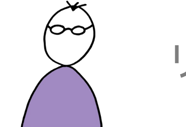
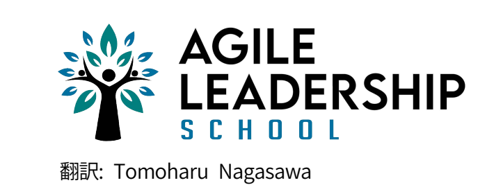

##

| 成 | 熟          | 度 |
|---|------------|---|
| レ | <b>\</b> " | ル |

スクラムマスター

プロダクトオーナー

開発者

リーダー

スクラムと他のプラクティスを 組み合わせる方法を他者に教える

組織における継続的改善に重点を置く

組織がアジャイルの原則を理解し、 適用できるように支援する

組織が継続的に顧客に影響を与えられる ようにする

組織やバリューストリームにおいて あらゆる人たちが上手くいくように 導き、促す ひとつ以上のプロダクトポートフォリオ に関する深い知識がある

継続的な価値の最適化と顧客との協力に 重点を置く

プロダクトのバリューチェーンにおける 計画づくり、予算化、損益の責任を持つ

継続的な価値提供によって顧客の幸せに 影響を与える

複数のチームとステークホルダーと共に 複雑なバリューチェーンを指揮できる 共通の規範に基づいて直感的に行動する

高品質なプロダクトを作り出す、 あるいは、その責任を持つ

フィードバックと学びの共有に関わる ために、あらゆる人たちと協力する

実際のユーザーによって確認できる価値 を頻繁に提供する

チームメンバーはお互いを疑いもなく 信頼し合う バリューチェーン全体の責任を プロダクトオーナーとチームに委ねる

力を引き出し、文化を守り、継続的改善 を促す

従業員全員の起業家精神と成長を促す

人々と組織がより大きなゴールを念頭に 置いて行動するように促す

あらゆる決定と責任を委ねる

スクラムと他のプラクティスに 関する幅広い経験を適用する

バリューチェーンにおける継続的改善に 重点を置く

ステークホルダーがアジャイルの原則を 理解し、適用できるように支援する

スクラムチームが継続的に価値を改善 し、提供できるようにする

チーム全体が上手くいくように導き、 促す プロダクト、バリューチェーン、顧客に 関する深い知識がある

継続的な価値づくりとステークホルダー との協力に重点を置く

プロダクトに関連する判断とリリース の計画を行なう権限がある

頻繁な価値づくりによって、すべての ステークホルダーに影響を与える

複数のチームとステークホルダーと共に バリューチェーンを指揮できる 規範を継続的に使用し、疑い、更新する

価値あるアウトカムを頻繁に提供する ことに責任を持ち、確約している

継続的に改善するためにステークホル ダーと協力する

高品質なプロダクトインクリメントを 提供するためにステークホルダーと 取り組む

信頼と尊敬があらゆる行動の基本に なっている 計画づくりと遂行をプロダクトオーナーに委ねる

アドバイス、コーチング、ファシリテー ションを行なう

チームが自己組織化し、価値づくりができる環境をつくる

人々が結束できるビジョンとミッション を提供する

重大な決定と責任以外はすべてを委ねる

スクラムの幅広い経験と他の プラクティスを用いた実験を適用する

チーム内における継続的改善に 重点を置く

チームがスクラムとアジャイルの価値基 準を理解し、適用できるように支援する

プロダクトオーナーが価値の提供と プロダクトの進行の可視化に集中できる ようにする

チームメンバーが責任を持ち、上手く なるように促す 価値づくりのあらゆるプロセスを 把握している

価値づくりと進捗に重点を置く

ステークホルダーと協力して、計画と プロダクトに関する判断を行なう

継続的なアウトカムを通じて ステークホルダーに影響を与える

バリューチェーンにおけるすべての ステークホルダーと協力するように チームを促す 共通する規範を発見し、収集し、新しい インサイトを生み出す

スプリントゴールの達成と品質の向上に 集中する

スクラムとアジャイルの価値基準を あらゆる対話のガイドラインとして使う

ステークホルダーに、より大きな影響を 与えるために積極的なフィードバックを 求める

チームメンバー同士がオープンである

プロダクトオーナーと共に計画づくり をする

規則、計画、品質基準の合意を得る

チームが独自の目標を設定できるように 境界の条件を示す

チームイベントに定期的に訪れ、 進捗状況を確認する

比較的重要な責任を委ねる

スクラムを「ガイドどおりに」適用した 経験がある

プラクティスをゴールとアウトカムに 結びつけることに重点を置く

スクラムやアジャイルの価値基準を よりどころにして、チームイベントの ファシリテーションを行なう

開発者が進捗を追跡し、作業を可視化 できるようにする

チームメンバーが自分たちの役割を理解 し、スクラムを「ガイドどおりに」適用 するように導く プロダクトバックログの責任を持ち、 管理する

スプリントゴールとプロダクト インクリメントの作成に重点を置く

計画とプロダクトに関する判断において ステークホルダーに影響を与える

透明性、進捗、アウトプットを高める ことで、より多くの信頼を得る

単一のプロダクトバックログから複数の ステークホルダーと協力できる 知識、プラクティス、品質の基準を共有 し、議論する

あらゆるイベントのアウトカムを確実な ものにし、スクラムの価値基準を学ぶ

違い、対立、共通の価値観を発見する

上手くいっていることを明確に計測しよ うとする

共通理解を模索する

計画を作成し、遂行はプロダクト オーナーに委ねる

規則、計画、品質基準への賛同を得る

チームに目標を与え、進捗、効率、 品質、アウトカムを確認する

進捗、アウトプット、品質の明確な計測を要求する

を要求する

主導権を握り、あまり重大でない責任を 委ねる

「ガイドどおりに」スクラムを適用する 方法を学ぶ

新しいプラクティスを学び、上手く使え るようにすることに重点を置く

あらゆるスクラムイベントを計画し、 ファシリテーションを行なう

進捗を追跡し、作業を可視化する

役目を遂行し、自己啓発を模索する

分析的な考え方と基本的なプロダクトの 知識がある

要求とプロダクトバックログアイテムの 作成に重点を置く

ステークホルダーによって作られた計画 とプロダクトの決定事項を遂行する

要求とフィードバックを収集すること で、ステークホルダーを満足させる

ステークホルダーの要望をチームの 具体的な作業項目に変換できる 個々の知識や基準によって、 取り組む作業が決まる

スクラムマスターにファシリテーション を頼る

対立を避け、個人の目標を目指し、 アウトプットを作り出す

プロセス、規則、指示に従う

安定、休息、帰属意識を目指す

計画、規則を作成し、予算を管理する

規則、計画の遂行、品質の目標を確実に 遵守させる

個人に目標を与え、進捗、効率、品質、 アウトカムを確認する

進捗を利益と株主の幸せによって 計測する

完全な管理を望み、指示的コミュニケー ションスタイルをとる

「リーダー」とは、リーダーシップを発揮する役目の総称であるが、 ここでのリーダーは、ステークホルダーのうち、 スクラムチームを支援する人たちを指している。 例えば、役員、部門長、事業の責任者などである。

