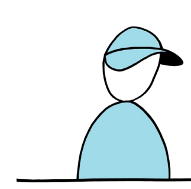
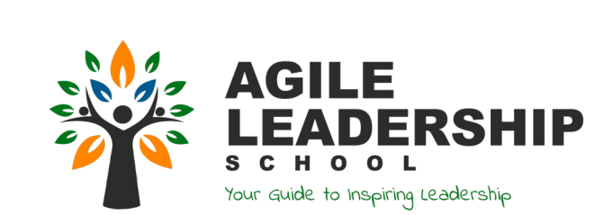
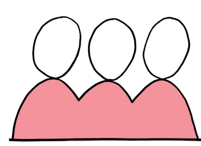

## **How mature is your Scrum Team?**

| Maturity Level | Scrum Master                                                                   | Product Owner                                                                      | Developers                                                                   | Leader                                                                    |
|-------------------|--------------------------------------------------------------------------------|---------------------------------------------------------------------------------------|------------------------------------------------------------------------------|---------------------------------------------------------------------------|
| 5                 | Teaches others how to combine Scrum with additional practices               | Deep knowledge on one\more product portfolio(s)                                    | Intuitively acting on commonly shared standards                           | Delegates responsibility for the full Value Chain to the PO & the team |
|                   | Focus on continuous improvements in the organization                        | Focus on continuous value optimizing and customer collaboration                    | Accountable or creating high quality products                             | Inspires\guards culture\stimulates continuous improvement              |
|                   | Helps the organization to understand & apply Agile principles               | Is responsible for plannings\budgets\ profits & loss of the products' value chain  | Collaborating with everyone to participate in sharing feedback & learning | Facilitates entrepreneurship & growth for every employee               |
|                   | Enables the organization to continuously have impact on customers           | Has impact on customer happiness based on continuous value delivery                | Delivering value on a frequent basis confirmed by actual users            | Facilites people & organization to act with a Greater Goal in mind     |
|                   | Leads & stimulates everyone in the organization\value stream to success     | Is able to lead complex value chains with multiple teams & stakeholders            | Team members trust each other blindly                                        | Delegates all decisions & responsibilities                                |
| 4                 | Applies extended experience with Scrum and additional practices             | Deep knowledge of the product\value chain\customers                                | Standards are continuously used\ challenged\updated                       | Delegates planning & execution to the Product Owner                    |
|                   | Focus on continuous improvements in the value chain                         | Focus on continuous value creation and stakeholder collaboration                   | Responsible and committed to frequently deliver valuable outcomes         | Gives advice\coaches\facilitates                                          |
|                   | Helps stakeholders to understand & apply Agile principles                   | Has the mandate to make product related decisions and release plans                | Collaborating with stakeholders to continuously improve                   | Creates an environment where teams can self-organize & create value    |
|                   | Enables the Scrum team to continuously improve and deliver value            | Has impact on all stakeholders based on frequent value creation                    | Working with stakeholders to deliver high quality product increments      | Provides a vision & mission that people can connect to                 |
|                   | Leads & stimulates the entire team to success                               | Can lead a value chain with multiple teams & stakeholders                          | Trust & respect are the basis of all acting                                  | Delegates all but critical decisions & responsibilities                |
|                   | Applies extended Scrum experience & experiments with additional practices   | Has overview of all steps in the value creation process                            | Common standards are discovered\ captured\new insights created            | Co-creates plans together with the Product Owner                       |
| 3                 | Focus on continuous improvements in the team                                | Focus on creating value & progress                                                    | Focussed on reaching sprint goals & improving quality                     | Ensures consensus on rules\plans\ quality standards                    |
|                   | Helps the team to understand & apply the Scrum\Agile values                 | Collaborates with stakeholders to make plans & product related decisions           | Using Scrum\Agile values as a guideline for all interaction               | Provides boundary conditions for teams to set their own targets        |
|                   | Enables the Product Owner to focus on value delivery and visualize progress | Has impact on stakeholders through continuous outcomes                             | Actively asking for feedback to have more impact on stakeholders          | Tracks progress by regularly visiting team events                      |
|                   | Stimulates team members in taking responsibility & become succesfull        | Inspires the team to collaborate with all stakeholders in the value chain          | Team members are open                                                        | Delegates more important responsibilities                                 |
| 2                 | Has situational experience in running Scrum 'By the Book'                   | Owns & manages the Product Backlog                                                    | Knowledge\practices\quality standards are shared\discussed                | Creates plans and delegates execution to the Product Owner             |
|                   | Focus on connecting practices with goals and outcomes                       | Focus on creating sprint goals & product increments                                | Ensuring the outcomes of all events & learning the Scrum values           | Ensures buy-in to rules\plans\quality standards                        |
|                   | Facilitates team events using Scrum\Agile values as a guide                 | Has influence on stakeholders in making plans & product related decisions          | Discovering differences\conflict\shared values                            | Gives team(s) targets and on progress\ efficiency\quality\outcomes     |
|                   | Enables the Developers to track progress & visualize work                   | Gains more trust by increasing transparancy\ progress & outputs                    | Working on explicit measurements of success                               | Asks for explicit measurements of progress\outputs\quality             |
|                   | Guides team members in understanding their role & apply Scrum 'By the Book' | Is able to collaborate with multiple stakeholders from a single Product Backlog | Looking for common understanding                                             | Wants to be in control & delegates less critical responsibilities      |
|                   | Learns how to apply Scrum 'by the book'                                        | Analytical knowledge & basic product knowledge                                     | Individual knowledge\standards determine what tasks people work on        | Creates plans\rules\controls budget                                       |

Is able to translate stakeholder wishes

Executes plans & product decisions made

Focus on creating requirements & Product

into concrete work items for a team

Satisfies stakeholders by capturing

requirements and feedback

by stakeholders

Backlog items

Executing operational work & searching

Tracks progress & visualizes work

Plans & facilitates all Scrum events

Focus on learning new practices and

for personal development

operational successes

belonging

them

Looking for stability\rest\a sense of

Following processes\rules\instructions

Avoiding conflict\pursuing individual

Relying on the Scrum Master to facilitate

targets\generating outputs

Wants full control & has a directive

Progress is measured by profit &

Ensures compliance to rules\plan

efficiency\quality & outcomes

execution\quality targets

Gives individual targets and on progress\

communication style

shareholder happiness
