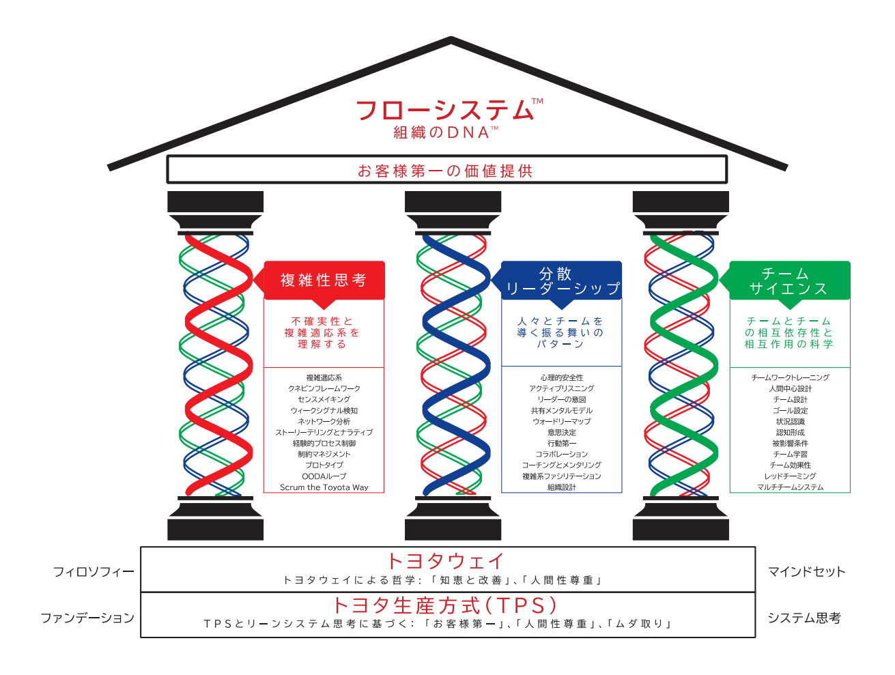
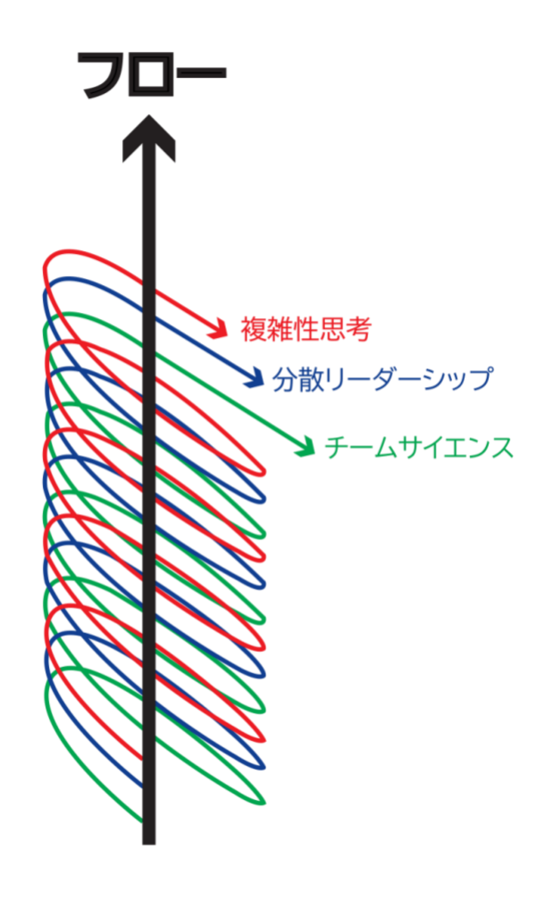
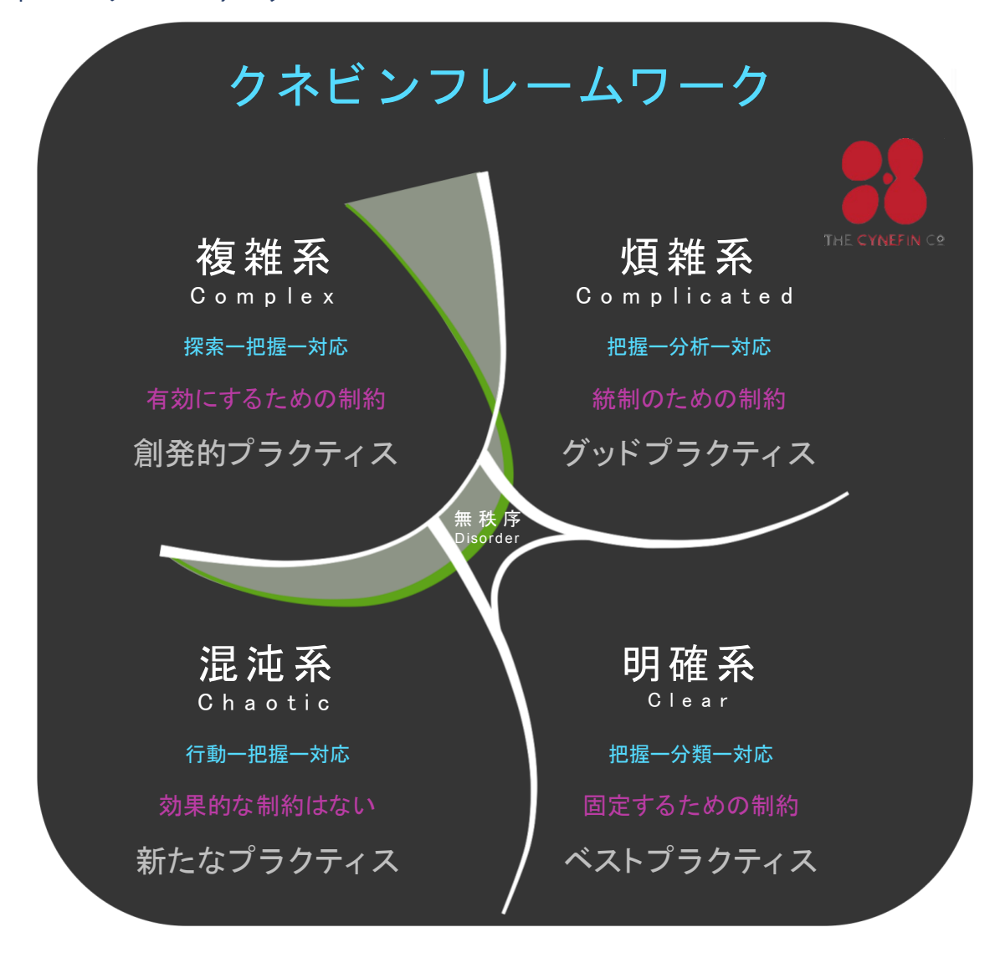

# [フローシステムガイド](https://flowguides.org/)

# 著者:

John R. Turner, Ph.D. Nigel Thurlow Brian 'Ponch' Rivera 訳者:

長沢 智治

バージョン 1.0(2019 年 11 月)

*©2019 John Turner Ph.D., Nigel Thurlow, Brian 'Ponch' Rivera.* 

The Flow System™ is Offered for license under the Attribution license of Creative Commons, accessible at <http://creativecommons.org/licenses/by/4.0/legalcode> and also described in summary form at [http://creativecommons.org/licenses/by/4.0/.](http://creativecommons.org/licenses/by/4.0/) By utilizing this Site and any information presented you acknowledge and agree that you have read and agree to be bound by the terms of the Attribution license of Creative Commons. The Flow System™, The DNA of Organizations™, and The Triple Helix of Flow™ are all trademarks of the copyright holders.

# 目次

| 目次                   | 2  |
|----------------------|----|
| フローシステム™の目的          | 4  |
| フローシステム™の定義          | 4  |
| フローシステム™の略歴          | 4  |
| フローシステム™の基本原則        | 5  |
| 1. お客様第一             | 6  |
| 2. 価値フロー             | 6  |
| 3. フローの三重らせん™        | 7  |
| 3a. 複雑性思考            | 8  |
| 複雑適応系                | 9  |
| クネビン®フレームワーク         | 10 |
| センスメイキング             | 11 |
| ウィークシグナル検知           | 12 |
| ネットワーク分析             | 12 |
| ストーリーテリングとナラティブ      | 13 |
| 経験的プロセス制御            | 14 |
| 制約マネジメント             | 14 |
| プロトタイプ               | 15 |
| 00DA ループ             | 15 |
| Scrum the Toyota Way | 16 |
| 3b. 分散リーダーシップ        | 16 |
| 心理的安全性               | 18 |
| アクティブリスニング           | 18 |
| リーダーの意図              |    |
| 共有メンタルモデル            |    |
| ウォードリーマップ            |    |
| 意思決定                 |    |
| 行動第一                 |    |
| コラボレーション             |    |
|                      |    |

| コーチング        | 22 |
|--------------|----|
| 複雑系ファシリテーション | 22 |
| 組織設計         | 23 |
| 3c. チームサイエンス | 23 |
| チームワークトレーニング | 24 |
| 人間中心設計       | 25 |
| チーム設計        | 25 |
| ゴール設定        | 26 |
| 状況認識         | 26 |
| 認知形成         | 27 |
| 被影響条件        | 27 |
| チーム学習        | 27 |
| チーム効果性       | 28 |
| レッドチーミング     | 28 |
| マルチチームシステム   | 29 |
| フローシステム™の理論  | 30 |
| フローシステム™の適用  | 31 |
| 参考文献         | 32 |
| 翻訳について       | 33 |
| 用語集          | 33 |
|              |    |

# フローシステム™の目的

フロー状態に到達するには、組織や機関が従業員同士や顧客間での相互作用に集中できるよう な方法で制約を整備し、アウトカムを生み出す必要である。制約には、構造、プロセス、環境 への影響が挙げられる。フローは、従業員が組織の摩擦に対抗したり、屈服したりするのでは なく、最終的には実行することに集中する状態を作り出す。

多くのプロジェクトマネジメント手法やアジャイルフレームワークは、タスク作業と計画の幻 想に着目しており、これらの活動を支援するためにどのような組織が構成されているかは考慮 されていない。組織や機関は、チームを活用しているが、チームワークのスキル開発が不十分 であり、チームの活用から得られる恩恵を最大化するためのリーダーシップの再構築に失敗し ている。これらの欠点は、組織や機関がフロー状態に到達するのを妨げるような更なる制約や 障壁をもたらす。

フローシステム™(TFS: The Flow System™)は、組織が複雑さを理解し、チームワークを受 け入れ、自律的なチームに基づいたリーダーシップ構造を実現するために再考された仕組みを 提供する。

# フローシステム™の定義

フローシステム™は、イノベーションと迅速な価値提供のための環境を整備し、市場に出すま での時間を短縮することで、付加価値のない活動を取り除き、ビジネスの成長を可能とする。

フローシステム™は、「お客様第一」の価値を提供するための「フロー(FLOW)」に基づく 総合的なアプローチである。TPS やリーンとしても知られているトヨタ生産方式を基礎とし、 組織の DNA™(DNA of Organizations™)として知られる新しい三重らせん構造を採用してい る。

フローシステム™では、組織や機関が望ましいアウトカムを達成するためのさまざまなメソッ ド、パターン、プラクティス、テクニックを理解することができる。

# フローシステム™の略歴

フローシステム™は、複雑で非線形な環境(複雑さ)におけるプロダクト提供から進化した。 1948 年から 1975 年の間に「トヨタ生産方式」(TPS: リーンとしても知られている)とトヨ タが 2001 年に最初に発表した「トヨタウェイ」の研究から拡張したものである。フローシス テム™は、リーン思考を進化させたもので、我々は「フロー思考」と呼んでいる。

トヨタ生産方式は、組織が達成可能な最高レベルの品質で卓越した製造を実現するためのモデ ルとなっている。トヨタ生産方式は主に顧客に焦点を当てている。トヨタ生産方式の柱は、

「自働化」(Jidoka)と「ジャストインタイム」(Just in Time)である。自働化には、問題が 発生したときに機械や工程を停止する機能が含まれている。ジャストインタイムには、付加価 値のない活動を取り除くことによる「ムダ取り」が含まれている。

トヨタ生産方式の基礎は、再現可能で予測可能なプロセスを確立するための「標準化」と継続 的改善の哲学である「カイゼン」(Kaizen)にある。トヨタ生産方式は、線形的で再現可能な 製造に取り組む際のリファレンスシステムになっている。しかしながら、曖昧な問題、変動性 の高いプロセス、非線形性、予測不可能性など、複雑さの特徴に対処するには限界がある。

トヨタウェイ 2001 は、全従業員が共有すべき価値観やビジネス手法を明確にしたものであ る。トヨタの「基本理念」であるトヨタウェイは、「知恵と改善」(Continuous Improvement)と「人間性尊重」(Respect for People)を柱としている。

トヨタでは、現状に満足することなく、新しいアイデアを発展させ、従業員の能力を高めるこ とで、継続的に業務改善に取り組んでいる。トヨタは、従業員、株主、ステークホルダーを尊 重し、優秀な個人と優れたチームワークが成功をもたらすと信じている。組織の基幹となる文 化は、絶えず変化するビジネス環境の中で進化していく必要がある。

フローシステム™の開発者は、既存のツールやフレームワークでは、複雑さを総合的に解決で きないことを認識していた。組織が不安定で曖昧な環境で機能するように最適化されていない からだ。また、複雑性思考はリーン思考とは異なり、新しいアプローチと理解が求められるこ とも認識していた。

フローシステム™の開発者は、今日我々が従っている考え方(ここで言及するには多すぎる) を認め、フローシステム™の発想の基礎として、トヨタ生産方式とトヨタウェイを留めた。

# フローシステム™の基本原則

フローシステム™は 3 つの基本原則で構成されている。

- 1. お客様第一
- 2. 価値フロー
- 3. フローの三重らせん™
  - a. 複雑性思考
  - b. 分散リーダーシップ
  - c. チームサイエンス

# 1. お客様第一

1946 年以来、トヨタ自動車は常に「お客様第一」を貫いてきた。1946 年 5 月に、日本のトヨ タ自動車販売の初代社長である神谷正太郎氏は、トヨタ自動車の経営者として初めて「常にお 客様を第一に考えなければならない」と公言した。

「お客様第一」の誓いは、それ以来、トヨタ生産方式やトヨタウェイに受け継がれている。組 織の方向性や戦略を決定する際に、顧客のニーズを考慮することは基本中の基本となってい る。お客様第一の誓いは 3 つのアウトカムを生み出す。

- 1. 最高の品質
- 2. 最小のコスト
- 3. 最短のリードタイム

フローシステム™は、これが現在も続いており、顧客への焦点を失った組織や機関が最終的に 成功することはないと認識している。また、「お客様第一」の誓いを倫理的に実現するために 不可欠な要素として、「人間性尊重」(Respect for Humanity と Respect for People)を強調 している。

「人間性尊重」(Respect for Humanity)は TPS の基本要素であり、「人間性尊重」 (Respect for People)は、「知恵と改善」と共にトヨタウェイの理念としての重要な柱であ る。トヨタでは、人間性尊重の課題は、ムダな作業を廃止し、人間の活力を意味のある効果的 な作業に結びつけることであるとしている[門田安弘, 1983]。重要となるアプローチは、「モノ づくりは人づくり」、すなわち「人づくりを通して、モノづくりを行う」ことである。

顧客がいなければ、従業員も投資家も株主もいない。また、コミュニティ開発への投資もな い。我々はこれらのことを理解している。「お客様第一」から始まるのである。

# 2. 価値フロー

一度、顧客と認識したら、その顧客を維持することに焦点が移ることになる。顧客を維持する には、その顧客への価値フローが継続するように組織的に組織自体を作り変えることが必要と なる。

フローは、複数の研究分野(人類学、生物学、生態学、物理学、心理学、チームサイエンスな ど)から得られた知識によって発展している概念である。進化する状態であるためには、シス テムの構成が進化し、適応し、新しい構造に変化していく必要がある。この構造は、破壊的で 複雑な環境で動作可能な制約のないシームレスなプロセスの提供を手助けする。

フローは、個人またはエージェント(動作の主体となる人、機会、出来事)が、顧客に価値を 提供するというゴールを得るために、環境を理解し、環境に反応することを学習する集団的な 社会活動である。

フローシステム™では、複雑性思考、分散リーダーシップ、チームサイエンスの要素が時間の 経過と共にますます相互接続され、フローがシームレスで自然となる。この時点で、「フロー 状態」に到達したと言える。

価値フローを作り出すには、組織が「お客様第一」のアウトカムを実現できるように組織自身 を構成する必要がある。

# 3. フローの三重らせん™

フローの三重らせん™(The Triple Helix of Flow™)は、組織の DNA™の 3 本の要素(複雑性 思考、分散リーダーシップ、チームサイエンス)からなる。

フローの三重らせん™は、3 本のらせん(複雑性思考、分散リーダーシップ、チームサイエン ス)の相互接続の性質に関連している。三重らせんは、組織が複雑な環境で活動するときに、 より革新的で、適応的で、アジャイルになる能力を向上させるために、新しいパターン、ネッ トワーク、知識に出現するエージェント間の相互作用を識別する。

フローの三重らせん™を実現するには、一定レベルの組織変革が必要である。3 本のらせんそ れぞれが真に相互接続し、同期し、組織の構造に組み込まれ、アイデアから顧客への価値提供 に至るまでシームレスに遷移することを保証するための変化が必要である。

フローは、フローシステム™のそれぞれのらせん下で特定されたメソッド、テクニック、ツー ルを用いるときに、制約のない環境でのエージェントの相互作用によって達成される。その 際、組織や機関のニーズが異なることを認識している必要がある。これらの違いから、それぞ れの組織や機関では、目的に応じたフローの状態に到達するために、さまざまなメソッド、テ クニック、ツールを導入する必要がある。

フローシステム™の目的は、並べられたすべてのメソッド、テクニック、ツールを活用し、実 践し、マスターすることではない。重要なのはそれぞれの組織や機関が、3 本のらせんから最 適なメソッド、テクニック、ツールを見つけ出し、望ましいゴールを達成することである。3 本のらせんを 1 つの凝集システムに相互接続することにより、フローを中断させない新しいプ ラクティスを実現する。

「フロー」の概念は、複雑性思考、分散リーダーシップ、チームサイエンスの要素が時間の経 過と共により相互接続されるようになるにつれて進化する過程である。フローは、さらにシー ムレスに、自然で、当たり前になっていく。

# 3a. 複雑性思考

フローの三重らせん™の第一のらせんは、複雑性思考である。

複雑性思考は、不確実性と複雑適応系の理解を手助けするための新しい思考形態である。複雑 な環境には「未知の未知」が現れるため、すべてが予測可能なわけではないことを受け入れる ことがまず必要となる。複雑な環境には、複数の可能な状態があり、場所によって異なり、短 時間に急激に状態が変化することがある。複雑性思考に不可欠なのは、自身の置かれている特 定の環境の多様性を理解することである。(特定の環境における)情勢の多様性が明らかにな れば、複雑性思考を適用することができる。

複雑性思考には、主に 2 つの手順がある。

手順 1: 複雑なシステムの特性を理解する

手順 2: システム、エンティティ、イベントが複雑適応系であるという世界観や視点を持つ

複雑な環境での運営は、全体が完全に理解されていない探索的なプロセスである。複雑性思考 は、説明できることに焦点を当てるのではなく、説明できないことに焦点を当てることができ るようにするための一助となるものである。複雑さには、曖昧さ、不確実性、未知のものが含 まれるため、これらの海を航海するのに役立つ特定のメソッド、テクニック、ツールが設定さ れている。

複雑性思考のらせんのためのメソッド、テクニック、ツールには以下が挙げられる。

- 複雑適応系
- クネビン®フレームワーク
- センスメイキング
- ウィークシグナル検知
- ネットワーク分析
- ストーリーテリングとナラティブ
- 経験的プロセス制御
- 制約マネジメント
- プロトタイプ
- OODA ループ
- Scrum the Toyota Way

# 複雑適応系

# 定義

複雑適応系(CAS: Complex adaptive systems)とは、動的でオープンな自己組織化のシステ ムであり、浸透性のある制約や境界を持ち、フィードバック機構と相互作用して適応性を発揮 するシステムである。複雑適応系は、動的であり外的要因に適応するために継続的に学習し、 独自の環境ニーズに対応するために必要に応じて新たな状態に遷移する。

#### 説明

いくつかの社会システムは、複雑適応系であると言われている。例えば、アントレプレナーシ ップ、政府、組織、チーム、そして社会さえも複雑適応系に含めることがある。

#### 特徴

複雑適応系には、以下のような特徴がある[\[1\]](#page-31-1)。

- 経路依存性がある
- 歴史がある
- 非線形である
- 創発的なアウトカムを含む
- その過程は還元して把握できない
- 適応的である
- 秩序と混沌の間を行き来している
- 自己組織化している

#### 定義

David Snowden によるクネビン®フレームワーク[\[2\]](#page-31-2)[\[3\]](#page-31-3)には、5 つの明確なドメイン(系)があ る。このフレームワークは、主に不確実性の下での意思決定のために、状況、判断、視点、対 立、合意形成に至る動的な変化を考えるために用いられる。

これらのドメインでは、それぞれのドメインで活動する際にどのようなメソッド、テクニッ ク、ツールを必要としているのかを明確にしている。

経営陣は、新しい視点から物事を捉え、複雑な概念を取り入れ、現実の問題や機会に対処する ことができるようになる。クネビン®フレームワークを使うことで、経営陣は自身の置かれて いる状況を把握でき、より適切な意思決定を行うことができ、現在のマネジメントスタイルが 原因で起こりうる問題を回避することができるようになる。

クネビン®とは、ウェールズ語で「Kuh-nev-in(ク・ネ・ヴ・イン)」と発音し、我々を取り 巻く環境や経験など、我々が決して理解できないような複数の要因が我々に影響を与えること を意味している。

### 説明

気候変動のような複雑な問題を扱う場合、問題の定義は曖昧で、解決策も未知である。また、 気候変動の問題につながる構成要素も未知である。複雑系ドメインでの問題解決は、単純系ド メインでの問題解決とはメソッド、テクニック、ツールが大きく異なる。

クネビン®フレームワークでは、問題をドメインに分類することで、その問題に対処するため の適切なツールを選択することができる。例えば、単純系ドメインまたは煩雑系ドメインで は、リーンのツールを選択し、複雑系ドメインでは、センスメインキングを必要とするだろ う。

#### 特徴

クネビン®フレームワークの知識領域には、単純系(simple)/明白系(obvious)、煩雑系 (complicated)、複雑系(complex)、混沌系(chaotic)、無秩序系(disordered)のそれ ぞれのドメインがある。これは意思決定フレームワークである。2019 年末の現在、David Snowden は、単純系/明白系ドメインを明確系(clear)に変更することを提案している。

# センスメイキング

#### 定義

センスメイキングとは、複雑な問題、状況、環境に対する理解を支援するために考案されたテ クニックである。センスメイキングは、個人やグループが複雑な環境や問題をよりよく理解 し[、共有メンタルモデルを](#page-18-1)開発し始めることができるように、自身の環境にまつわるストーリ ーの開発を支援する。

# 説明

複雑な環境では[、ストーリーテリングとナラティブが](#page-12-0)環境や状況の理解を手助けする。消火活 動中に、消防士は自身の周囲の状況を他の消防士に伝え、各消防士が現状を理解できるように する。このような複数の消防士から語られるストーリーが、チームの状況把握に役立ってい る。

#### 特徴

センスメイキングには、以下の特徴がある[\[4\]](#page-31-4)。

- 相互作用と会話(ソーシャル)
- 参照フレームの明確化(アイデンティティ)
- 関連する過去の経験(ふりかえり)
- 現在の環境において無視された詳細(手がかり)
- 変更された印象の更新(進行中)

- 起こりうることの最もらしいストーリー(妥当性)
- 思考を明確にする行動(実施)

センスメイキングは、リアルタイムで行われるときに最も効果的である。

# ウィークシグナル検知

#### 定義

ウィークシグナル検知(Weak Signal Detection)とは、将来の変化の兆候を早期に発見するこ とができるメソッドで、環境に存在する機会と脅威を認識することが含まれる。ウィークシグ ナル検知は、問題が手に負えなくなる前に早期に発見するために不可欠であり、将来の変化の 兆候を早期に察知できるメソッドである。

ウィークシグナルは、変化の先行指標であり、それを認識しなければならない。組織における 突然の不慣れな変化は、組織のどの部門をも脅かす可能性がある。このような変化に気づかず にいると、利益の大きな減退や、新たな機会の損失になる可能性がある[\[5\]](#page-31-5)。自身の環境を継続 的に調査や監視することで、これまでなら発見できなかった脅威を早期に発見することができ る。

#### 説明

対策が有効でないことが判明する前に、ビジネスの脅威を検知することができるのはウィーク シグナル検知の一種である。安全重視の環境では、ウィークシグナル検知が必要となる。組織 や機関の持続可能性を確保するためには、これらのウィークシグナル検知のためのツールやテ クニックを導入する必要がある。もし管理職がウィークシグナル検知を受け入れることができ れば、脅威が目に見えて具体的になるより以前に、多くのことを行うことができるようにな る。

### 特徴

ウィークシグナル検知では、さまざまな視点(分野横断的な視点)を用いて環境を継続的に観 察し、内外の背景にある異常な振る舞い、合図、出来事を特定する。

# ネットワーク分析

#### 定義

複雑適応系のようなオープンシステムは、ネットワークとして捉え、分析することができる。 ネットワーク分析では、チーム間や組織間の相互作用など、構成要素間の相互作用もしくは、 リンクを見ることができる。ネットワーク分析は、システムとエージェント間の十分な情報の 流れを確保するための実用的な方法を開発するのに役に立つ。

### 説明

ネットワーク分析は、文化、自然、頭脳、生物、経済、生態系などのさまざまな種類のネット ワークの分析に用いられている[\[6\]](#page-31-6)。ネットワーク分析は、組織の成功に不可欠な情報を持つ組 織単位の重要人物を特定するために用いられる。これらのさまざまなネットワークがどのよう にコミュニケーションをとり、情報の共有と保管をし、コラボレーションをしているかを理解 することは、効果的な組織設計に必要なことである。

# 特徴

ネットワーク分析は、ダイアド(個人対個人などの2者関係)、ノード(リーダー、チーム、 組織など)、ネットワーク(リーダー対個人、チーム対チームなど)を分析できる柔軟性があ る。ネットワーク分析では、ダイアド、ノード、ネットワークのそれぞれの集合間の関係、リ ンク、相互作用を見ることができる。

# ストーリーテリングとナラティブ

#### 定義

人々が理解の感覚を表出化することによって起きる知識創造の産物のことである。何らかのモ ノや特定の出来事というのは彼らにとって何を意味するのだろうか。このようなナラティブ (繋がりのある出来事の話し言葉または書き言葉)、つまりストーリーを通して、複雑な環境 で起きていることをより意味のある形で表現することができる。

#### 説明

裁判員制度における陪審員は、裁判中に触れるストーリーやナラティブをもとに判断を下すこ とが多い。陪審員は、これらのストーリーに意味を持たせて審議に臨む。陪審員の判断は、こ れらのストーリーまたはナラティブの総括と考えることができる。ビジネスにおいては、従業 員のストーリーやナラティブを収集することで、企業や組織の現状を把握することができる。

従業員に、ニュースの見出しとそこから連想できるニュースの内容、そこに紐づいたトピック や課題を書き出すことができれば、将来の意思決定、戦略、計画を伝達するためのパターンや 共通のテーマを総合していくことが可能になる。

### 特徴

ナラティブは、しばしば作成物、文章、記録、言語、比喩、ストーリーなどを通して表現され る。

# 経験的プロセス制御

# 定義

サイエンスとは、ある現象や問題を説明したり、予測したりする理論を検証するプロセスであ る。この経験的プロセスは、妥当で、信頼性が高く、厳密な、つまり時間をかけて試し、検証 された多くの異なるメソッドと手順が含まれている。経験的プロセスは、客観的であり、意思 決定のアウトカムから主観や人のバイアスを取り除こうとするものである。実験とは、我々を 取り巻く環境を理解するための基本的なものであり、未知のものや観察できないものをさらに 解明することができると考えられている。

# 説明

サイエンスは、経験的プロセスによって新しい知識が得られるだけでなく、経験的な研究から 得られた知見が、現在の信念、プラクティス、教義に挑むことができるかを示す豊富な例示を している。一つの例である PDCA — 計画(Plan)、実行(Do)、評価(Check)、改善 (Act) — は、プロセスやプロダクトの継続的な改善を制御し、可能にするための反復的な 4 つのステップのプロセスである。

### 特徴

経験的プロセスは分野によって異なり、問題の認識、(可能であれば)問題の定義、理論化、 計測、観察、分析、解釈、報告といった構成要素に積極的に取り組む必要がある[\[7\]](#page-31-7)。

# 制約マネジメント

#### 定義

制約とは、エージェントの振る舞いに影響を与える制限や規定のことである。制約は、自己由 来のものであり、認知的に構築できるものである。複雑な環境にあるチームや組織では、どの ような制約があるのかを把握することが不可欠である。組織が効果的に機能するためには、不 要な制約を取り除くマネジメントが必要である。制約には、有効にするためのものと、抑制す るためのものがある。

「有効にするための制約」とは、エージェントが他の方法では不可能なことをできるようにす ることである。「抑制するための制約」とは、エージェントが何かをすることを妨げたり、特 定の方法でしか行えないようにしたりすることである。

# 説明

組織におけるフローを有効にし最適化するには、「抑制するための制約」の数を制限しつつ、 「有効にするための制約」を最適化していく必要がある。「有効にするための制約」とは、エ ージェントが自律的に意思決定を行いながら、望ましくないアウトカムを防ぐために定義され た境界の中で活動できるようにすることである。「有効にするための制約」は付加価値のこと である。規制機関によって指示されたり、義務付けられたり、求められたりしたものは、しば しば「抑制するための制約」として課すことになる。通常、「抑制するための制約」は付加価 値のないものである。

# 特徴

ストーリーテリング、共有メンタルモデルの開発、ナラティブの共有、ウィークシグナルの特 定などは、制約マネジメントのテクニックとして成功している。

# プロトタイプ

#### 定義

プロトタイプとは、複雑な問題の表現、物理モデル、計算式を指す。プロトタイプは、継続的 なテストとリファインメントを通じて、複雑な問題の一部を具体化し、複雑さへの理解を深め ることに貢献できる。

# 説明

(自動運転車の)新規顧客層のために、(自動車の)フルモデルを設計するよりも、最初に自 動車全体を作るのではなく、個々の部品を特定し、顧客にとって何が望ましいか、または、何 が受け入れられるかを見つけることから始める方が、より安価で効果的である。

#### 特徴

プロトタイプは、実験やモデル(コンピューターや物理的なもの)、計算式(計算量的なも の)の形式をとることができる。プロトタイプは、全体に対してある程度の親近感や関係性を 持たなければならない。プロトタイプは、馴染みのあるもの(既知の部分)をモデル化し、馴 染みのないもの(未知のもの)を理解することで、全体を理解するのに役に立つ[\[8\]](#page-31-8)。

# OODA ループ

#### 定義

OODA — 観察(Observe)、方向づけ(Orient)、判断(Decide)、行動(Act) — ループの ことで、非線形な意思決定プロセスであり、行動のガイドである。OODA ループは、空軍大佐 の John Boyd による 40 年間の成果である。John Boyd は、軍事航空の戦術、戦略、サイエン ス、初期の複雑性思考、そして、トヨタ生産方式からの学びを組み合わせた。

#### 説明

OODA ループは意思決定のプロセスである。利用可能なすべての関連情報が観察可能であるこ とを確認し、効果的な意思決定のための方向づけを観察者に訓練するものである。適切な判断 が決まれば、その判断を迅速に実行することが可能となる。しかしながら、まず行動し、その アウトカムを観察し、方向づけをすることで、今後の意思決定に役立てることが可能になる。

OODA ループは、明示的な意思決定プロセスよりも暗黙的な意思決定プロセスを優先してい る。それは個人や組織のパフォーマンスを評価するときに、アウトカムからの判断を分離する 特色があ[るセンスメイキング\(](#page-10-0)観察や方向づけ)のループを含んでいる。OODA ループは、 「自己組織化、創発、自然淘汰の進化的で、制限がなく、均衡からかけ離れたプロセス」[\[9\]](#page-31-9)と 説明される。

## 特徴

OODA ループは、ループ内のどの段階からでも始めることができ、その時の問題や状況により 左右される。OODA ループの構成要素は、観察、方向づけ、判断、行動であり、これは反復的 なサイクルである。OODA ループの焦点は、個人と組織がどのように観察し、判断し、行動す るかを決定する経験則、認知バイアス、確立した信念といった指向性である。

# Scrum the Toyota Way

# 定義

Scrum the Toyota Way とは、従業員や組織が、問題を特定し定義するスキル、顧客プロファ イル、チームワークスキル、計画と見積もりスキルなどを通じて、創発的なアウトカムとして アジリティを開発し、可視化のテクニックを身につけることを目的としたトレーニングプログ ラムのことである。振る舞いのパターンとしてスクラムフレームワークや、さまざまなツール や認知スキルの適用を通じて、システム思考アプローチと複雑性思考戦略の境界を理解するこ とができるようになる。

#### 説明

組織の部門や部署は、Scrum the Toyota Way のトレーニングを通じて、機能的なハイパフォ ーマンスチームとしてより効果的に活動することを学習する。

#### 特徴

Scrum the Toyota Way の特徴は、さまざまなツールやテクニック、概念を導入したり、洗練 させたりすることにある。

# 3b. 分散リーダーシップ

分散リーダーシップの概念は、組織での水平方向、垂直方向、そしてその間にあるあらゆる場 所に広がるリーダーシップを意味している。リーダーシップは、個人から始まり、リーダーシ ップのモデルは、集団的な構成となっていく。

リーダーシップは、個人レベルでは自己リーダーシップと自己効力感の成長テクニックで育成 され、実践される。チームレベルでは、シェアドリーダーシップがリーダーシップのモデルと なり、機能的リーダーシップモデルがチームの監督役として機能する。

機能的リーダーシップでは、リーダーとフォロワーという 2 者関係を見る多くのリーダーシッ プモデルとは対照的に、リーダーとチームという関係性を見ている。機能的リーダーシップ は、橋渡し役(バウンダリースパナー)とも呼ばれ、チーム間、チームとマルチチームシステ ム間の境界で機能する。それらの役割と責任は、リソースの提供、相互作用の促進、活動の調 整、ゴールの調整などが、一例となる。経営陣レベル(C レベル)では、期待に応じて従来の 階層構造を維持することもできる。

これまでの調査で、多くのチームに基づく構造[やマルチチームシステムが](#page-28-0)、ハイブリッドなリ ーダーシップによってうまく機能していることが明らかになっている。フローシステム™に は、ハイブリッドまたはブレンドされたリーダーシップモデルが組み込まれている。このハイ ブリッドなリーダーシップモデルには、戦略的リーダーシップ、インストルメンタルリーダー シップ(訳注: 人的リソースを最大活用するリーダーシップ)、グローバルリーダーシップと いったリーダーシップ理論の要素が取り入れられており、チームに基づく組織構造や複雑な環 境に対して有効である。

すべての組織が 3 つのリーダーシップモデルすべてを経営陣レベルで導入するのではなく、そ れぞれのリーダーシップ理論から組織のニーズに合った要素を導入し、先述したチームに基づ く構造を最もよく支援するようにすることを意図している。ニーズは組織によって異なるた め、それぞれの組織に合ったリーダーシップの特性や構成要素を見極める必要がある。

フローシステム™における分散リーダーシップのらせんは、組織全体のリーダーを継続的に活 性化するプロセスを提供することで、産業全体に大胆で破壊的な動向をもたらすことができる 集団的なリーダーシップを組織内に出現させることができる。

分散リーダーシップのらせんのためのメソッド、テクニック、ツールには以下が挙げられる。

- 心理的安全性
- アクティブリスニング
- リーダーの意図
- 共有メンタルモデル
- ウォードリーマップ
- 意思決定
- 行動第一
- コラボレーション
- コーチングとメンタリング
- 複雑系ファシリテーション
- • 組織設計

# 心理的安全性

# 定義

心理的に安全な環境とは、チームメンバーや従業員が嘲笑や叱責を受けることなく、自由に自 分の意見を述べたり、質問したりできる環境である。チームメンバーや従業員は、プロフェッ ショナルな視点や批評である限り、自由に率直な意見を述べることができる[\[10\]](#page-31-10)というのが、最 も適切な表現である。心理的安全性は、恐怖の文化を取り除く。

### 説明

トヨタ生産方式では、従業員が自由にアンドンのひもスイッチを引くことができる。アンドン のひもスイッチは、生産ラインの長さに合わせた操作用引きひも(またはボタン)で、重大な 問題や問題になる可能性がある場合に、作業者が作動させて生産を停止し、管理職に警告す る。

生産を停止したことによる叱責や罰則の心配はなく、問題を発見した従業員は自由にアンドン のひもスイッチを引くことができる。アンドンのひもスイッチは、心理的に安全な作業環境の 比喩として機能し、従業員は適切な判断や行動がなされているかどうか、自由に質問をした り、調べたりすることができる。また、適切な人材がこれらの行動をしていることも保証す る。

# 特徴

心理的安全性とは、期待値の共有、目的の共有、話を聞いてもらえる信頼、失敗の受容、継続 的な学習などの特徴で表される[\[10\]](#page-31-10)。

# アクティブリスニング

# 定義

リーダーシップには、話すことと同じくらい聴くことが必要である。アクティブリスニング (積極的な傾聴)は、リーダーシップに不可欠な特性であり、身につけることができる。アク ティブリスニングとは、会話に積極的に参加し続けるための傾聴パターンを指す。誰かが話を している間は注意深く耳を傾け、言われたことを言い換え、反映し、判断を控え、助言を与え ることである。

# 説明

リーダーは、フォロワーが遭遇している問題を聴き出すために耳を傾けなければならない。リ ーダーとフォロワーの相互作用は、リーダーが指示するだけではなく、リーダーがフォロワー とやり取りを行い、彼らの問題を理解し、彼らの仕事に目的や意味を与える話をしなければな らない。

アンドンのひもスイッチは、アクティブリスニングが行われる好例である。アンドンのひもス イッチが作動すると、リーダーや責任者と従業員の間の一連のやりとりが始まることになる。 このような相互作用は、お互いが等しく聴くことと話すこととで、問題を理解し、解決するた めに行う。

#### 特徴

アクティブリスニングでは、聴く、話す、信頼や関係を築く、関心を示す、具体的に質問をす る、簡潔な肯定文を用いるといった機能を通じてリーダー[のセンスメイキングの](#page-10-0)プロセスを支 援する。アクティブリスニングは、自身の考えや先入観に捉われることなく、相手のニーズを よりよく理解するための認知プロセスを手助けするものである。

# リーダーの意図

#### 定義

リーダーの意図とは、特定の結果ではなく、望ましいアウトカムに焦点を当てることである。 リーダーの意図と望ましいアウトカムを理解することで、個人やチームは望ましい結果を念頭 に置きながら、必要な活動を自由に行えるようになる。アウトカムを得るための適切な方法は 1 つではなく、リーダーの意図として示したモデルを通じて、個人やチームは自由に自身に合 った方法を見つけることができる。

# 説明

また、司令官の意図と関連付けると、軍の分隊は全体的な目標を大まかに把握している。しか しながら、交戦時には未知の部分が多すぎるため詳細な計画に沿って行動することができな い。戦隊は彼らの最終的なゴールを達成するために、必要に応じて自由に行動方針を変更する ことができる。

#### 特徴

リーダーの意図の特性は、計画立案、ミッション分析、行動指針の策定/分析/比較/承認、 最終レビューを含む。リーダーの意図は、望ましいアウトカムの目的を個人的に表現すること である。これは明確で、簡潔で、理解しやすいものでなければならない。またリーダーシップ が想定している意思決定の達成方法や、目的を達成するための最終的な説明や条件も含むこと がある。

# 共有メンタルモデル

## 定義

共有メンタルモデルとは、チームメンバー間で共有される状況やプロセスに関する集合的な理 解、認識、知識を築くことである。

### 説明

チームメンバーそれぞれが、チームの目標について異なる理解をしている状態で、計画に基づ いた作業をした場合、それは共有メンタルモデルが構築されていないことを示している。チー ムメンバーは、すべてのタスクとゴールについて、それぞれのメンバーが同様かつ的確に理解 できるように話し合わなければならない。共有メンタルモデルを構築するには、効果的な計画 と事前説明のテクニックが必要となる。

#### 特徴

この集合的理解には、メンバーが問題、定義、プロセス、ゴール、リソースについて共通の理 解を持つことが不可欠である。

# ウォードリーマップ

#### 定義

複雑さを理解するためには、可視化テクニックが重要となる。ウォードリーマップ(Wardley Maps)は、組織の風景、ビジネスやサービスの構造を表現し、顧客ニーズに応えるための構 成要素をマッピングするものである。観察できないようなパターンを浮き彫りにして、自身の 状況認識を向上させるために活用できる。

ウォードリーマップは、2005 年に作成したと主張する Simon Wardley に因んで命名された。

# 説明

ウォードリーマップは、プロダクトの開発プロセスを強調するために描かれることがある。こ のマップは、プロダクトの開発に関わる各プロセス(X 軸)の進化(時間軸)を示している。 顧客から見えるプロセスは Y 軸の上位に位置し、本質的に顧客からは見えないプロセスは Y 軸 の下位に位置する。

マッピングを行うと、どのプロセスが顧客にとって付加価値がない活動であり、どのプロセス が顧客にとって価値を最大化するのかがわかるようになる。このような認識によって、組織は 顧客ニーズに、より応えられるように再びプロセスに焦点を合わせる。

#### 特徴

ウォードリーマップには、可視化、文脈依存、構成要素の位置、そして、Y 軸に沿った活動 (高い可視性)、実践、データ、知識(低い可視性)の 4 つの種別を取り入れた動きの要素が 含まれる[\[11\]](#page-31-11)。

# 意思決定

# 定義

機能横断的かつ多様性のあるチームは、一個人が単独で取り組むよりも複雑な問題に取り組む ことができる。チームが自律的に機能し、組織により適応させることができるようになるに は、チームの意思決定能力を高めることが不可欠である。

# 説明

チームはさまざまな情報源からウィークシグナルをリアルタイムに識別することができ、チー ムメンバーが意思決定をする際に、いくつかの選択肢から選択できるようになる。意思決定は もはや一個人に帰するものではなく、集団であるチームに属するものである。チームでの意思 決定では、個人で行うよりも、より多様性があり、包括的な選択肢を提供することができる。

#### 特徴

複数の個人が協力して問題や状況を分析し、代替案を検討、評価し、その中から一つの解決策 や複数の解決策を選択する。チームの意思決定には、問題、リソース(情報、知識、技術)、 課題に対処するために必要となるチームにおける知識、スキル、能力について合意する必要が ある。

# 行動第一

# 定義

行動第一(Bias Towards Action)は、不確実な時代において、リーダーとチームの双方が自ら 判断できるようにするリーダーシップのテクニックである。

# 説明

行動第一では、潜在的なアイデアや変化を議論することに集中するのではなく、アイデアを行 動に移し、変化を実行に移し始めることに集中する。リーダー(またはコーチ)とチームが協 力して意思決定を行い、競争相手(外敵)を取り除くために行動指針を決定する。企業は、完 璧を際限なく追求するのではなく、前進することに集中すべきである。

#### 特徴

リーダーやチームは自律的に行動し、自己組織化や自己適応が自在にできる。注意力の散漫を 減らすことができる。より小さな判断ができるようになる。考えすぎを止める。目的のある行 動に集中する。

# コラボレーション

#### 定義

コラボレーションとは、特に知的活動において、他者と共同や協力することである。2 人以上 の人や組織がタスクを完了したり、ゴールやアウトカムを達成したりするために協力するプロ セスのことである。

### 説明

チームは共同作業であるが、小さなグループや部門、教室、トレーニングセッション、社会的 な集まり、地域政治も同様である。構造化された共同作業のメソッドは、振る舞いやコミュニ ケーションの内省を促す。このようなテクニックは、複雑な問題解決に取り組む共同作業者の 成功率を高めることを狙っている。コラボレーションは、組織内で期待されるようになり、知 識の創造と知識の普及に参加するメンバーを巻き込んでいく。

# 特徴

コラボレーションには、効果的なコミュニケーション、アクティブリスニング、チームプラン ニング、イノベーションの能力、知識の共有、多様なスキルセット、リソースへのアクセス、 明確な期待値、そして、共通ゴールが必要である。

# コーチング

#### 定義

コーチングとは、従業員やチームメンバーの能力を高め、プロセスを管理できるようにし、潜 在能力を最大限に引き出し、自律できるように支援する役割のことである。

# 説明

コーチは、チームメンバーが一丸となって成功するために、トレーニングし、教育する役割を 担っている。コーチは、チームメンバーのパフォーマンスを分析し、関連するスキルを示し、 働きかけとメンターシップとリーダーシップを発揮することで、チームメンバーをトレーニン グする責任を持っている。コーチは、他の人が学ぶことを手助けする。

### 特徴

コーチングは、外部の人材が行うこともあるが、チームメンバー個人がコーチとして行うこと もある。コーチングでは、スキルやテクニックの育成、チームメンバーのモチベーションの向 上、仕事の意味や明確さの浸透、改善のための提案とフィードバック、活動やリソースの調整 を行うことで、チームメンバーの自己主導と自律を狙っている。

# 複雑系ファシリテーション

#### 定義

複雑系ファシリテーションとは、複雑な問題に影響を与える認知的に多様なグループを用い て、未知の知見を明らかにするためのテクニックである。このファシリテーションテクニック は、ファシリテーターをプロセスから排除し、自己組織的に運営するものである。この形式の ファシリテーションは、直感に反しているため、いくつかのアンラーニングのメソッドを必要 とする。

#### 説明

複雑系ファシリテーションの例としては、アンカンファレンスセッションが挙げられる。アン カンファレンスセッションとは、自分達の都合に合わせて会議室に集まり、議論したい課題や 悩みを発言することである。時間が経つにつれ、アンカンファレンスでは、参加者の関心ごと を反映したクラスターのグループが出現する。

# 特徴

従来のファシリテーションでは、ゴールに向けてグループを軌道に乗せ、プロセスや内容にお けるあらゆる障壁を取り除くために最大限の努力を行うことが求められる。複雑系ファシリテ ーションでは、公式なファシリテーターがいなくなり、すべての権力や階層的な肩書きがなく なり、混乱を必要とし、時に混沌を感じることができる。

# 組織設計

#### 定義

組織設計では、ワークフロー、手順、構造、システムの機能不全の側面を特定し、現在のビジ ネスの実現とゴールに合わせてそれらを再調整し、さらに新しい変化を起こすための計画を策 定する段階的な方法論である。組織設計は、組織の構造や運営方法を形成するためのプロセス である。

#### 説明

階層構造で組織化されていることにより、組織の構造が複雑になればなるほど、組織による顧 客への価値提供を阻害する制約が増えていく。コンウェイの法則[\[12\]](#page-31-12)によれば、組織の構造は、 コミュニケーションの道筋に従う。曖昧さ、複雑さ、破壊的な時代において、組織はよりフラ ットな構造を用いて設計されるべきであり、より適応できる必要があり、最近構築したチーム に基づく構造を支援できるようにする必要がある。

#### 特徴

組織設計では、個々の作業者、チーム、マルチチームシステムを表すものであり、それぞれの 構成要素を支援するリーダーシップの役割を持つものでなければならない。 組織設計は、付加 価値活動を最適化し、顧客への価値の流れ(価値フロー)を促進することを考慮すべきであ る。組織ではなく、バリューストリームを提供する。

# 3c. チームサイエンス

チームサイエンスの分野は、現場におけるチームや小さなグループに関するあらゆること(対 人葛藤、グループ内外の力関係、チームの心理的安全性、チーム効果性など)を研究する専門 分野である。

チームサイエンスは、チームが動的で、分野横断的で、多次元的で、複雑適応系であることを 認識している。フローシステム™におけるチームサイエンスのらせんは、複雑で、破壊的な環 境に対処するためにチームに基づく構造を用いる恩恵を最大化するために活用されている。

チームサイエンスのらせんのためのメソッド、テクニック、ツールには以下が挙げられる。

- チームワークトレーニング
- 人間中心設計
- チーム設計
- ゴール設定
- 状況認識
- 認知形成
- 被影響条件
- チーム学習
- チーム効果性
- レッドチーミング
- マルチチームシステム

# チームワークトレーニング

# 定義

チームのトレーニングとは、チームを活用し、仕事をする上で個人の手順に関する知識と熟練 度(タスクワーク)を高めるだけでなく、結束力のあるユニットやチームとして機能する(パ フォーマンス)ための対人関係スキル(チームワーク)を育成するトレーニングのことであ る。チームワークトレーニングは、個々のチームメンバーに注力するのではなく、チーム単位 に焦点を当てている。

#### 説明

チームワークトレーニングを受けたチームは、トレーニングを受けていないチームよりも優れ たパフォーマンスを発揮することが調査で示されている。チームは、効果的なチームになる以 前に、チームワークのスキルトレーニングを受けるべきである。チームワークのスキル育成 は、低いパフォーマンスのチーム(チームワークのスキルトレーニングを受けていないチー ム)と高いパフォーマンスのチーム(チームワークのスキルトレーニングを受けているチー ム)を分けることが重要な要素の 1 つとなる。チームワークのスキル育成をせずに、高いパフ ォーマンスのチームには到達できない。

# 特徴

チームワークトレーニングは次の条件を満たす必要がある。

- 状況に応じて必要なスキルを特定すること
- 必要なチームワークのスキルを学ぶことに集中すること
- チームメンバー全員を対象としたトレーニングを行うこと
- 事前説明と事後報告を含めること
- リアルタイムで行われること
- 効果性を評価すること

# 人間中心設計

# 定義

人間中心設計とは、設計段階において、すべてのステークホルダー(コミュニティメンバー、 顧客、デザイナー、従業員、メーカー、サプライヤーなど)が参加するプロセスである。これ には、新しいプロダクトや問題解決のための設計に、人間的な要素を取り入れることを含んで いる。

#### 説明

その問題を解決するために、問題の影響を受けている人たちを設計プロセスに参加させる。ス テークホルダーも設計チームの一員になることができる。人間中心設計は、問題を文書化する ことだけに焦点を当てるのではなく、設計プロセスを解決するために参加型の関与方法として 活用する。

# 特徴

人間中心設計の重要な要素の 1 つは、機能ではなく内容に焦点を当てることで、プロダクトが いかに機能するかではなく、特定の環境にいかに適合させることができるかに集中する。その 他の特徴としては、共感、観察、コラボレーション、文脈的フレーミング、学び、可視化、迅 速なプロトタイプの作成などが挙げられる。

# チーム設計

#### 定義

チーム設計とは、チームを構成する方法であり、チームがチームのタスクを完了するために必 要な知識、スキル、能力を持っていることを保証することである。

#### 説明

効果的なチーム設計は、効率的なタスクワークの遂行や完了に不可欠である。また、効果的な チームワークを可能にするにも不可欠である。チームが大きすぎたり、小さすぎたり、必要な スキルや知識が不足していたりすると、効果的でなくなるだろう。また、チームワークに不可 欠なスキル(対人関係や対立マネジメントのスキル、モチベーションのスキルなど)が不足し ているチームも効果的にパフォーマンスを発揮することはできない。チーム設計やチーム構成 は、チームの成功に不可欠である。

## 特徴

チーム構成の特徴には、チームメンバーの知識、スキル、態度、能力、それからチームの知識 と経験の多様性、さらに、チームメンバーの属性と文化の混合が含まれる。チームは、ゴール や目標を達成するのに十分な大きさでなければならないが、迅速な意思決定と実施を可能にす るのに十分な小ささでなければならない。

# ゴール設定

# 定義

ゴール設定は、特定の期間に予測できる望ましいアウトカムのことである。ゴールは、さまざ まな分析レベルで発生する。近位ゴールは個々のチームにとって固有のものである。遠位ゴー ルは、近位ゴールをより広範な組織的なアウトカムにつなげるものである。

#### 説明

自身のチームのゴールだけに焦点を当てているチームは、組織全体の目的を軽視し、他のチー ムから孤立し、組織的なアウトカムに支障をきたす可能性がでてくる。

個々のチームには、ゴール達成に向けた指針となる具体的なゴール(近位ゴール)があり、上 位の組織的なゴール(遠位ゴール)と関連づけられている必要がある。チームゴールは、組織 的なゴールと連動していなければならず、チームメンバー全員がチームゴールと組織的なゴー ルの両方とそれらの関連性を認識していなければならない。複数チームが協力する場合は、近 位ゴールと遠位ゴールの両方を定義しなければならない。

### 特徴

チームゴールは、明確に定義され、計測可能なアウトカムを持ち、組織の包括的な目的と関連 づいていなければならない。メンバー全員が、それぞれのゴールがお互いにどのように関連し ているかを知っていなければならない。

# 状況認識

#### 定義

状況認識とは、ある出来事に対してある人がどのように反応するかを決定づけるための知識を 考慮した上での環境的要素に対する認識と理解のことである。

#### 説明

状況認識とは、脅威、リスク、機会をリアルタイムで認識し、その対応方法を迅速に判断する 能力のことである。

#### 特徴

状況認識の特徴には、ウィークシグナルを検知する能力、情報を総合する能力、新しい知識を 創造する能力などが含まれる。

# 認知形成

# 定義

個人レベルでは、認知形成(Developing Cognitions)には、知識の形成、スキルの形成、問題 解決の形成、気質の形成が含まれ、これらは個人として自身の周囲について考え、理解するの に役に立つ。

共通認知は、チームレベルで発生し、チームメンバーはあるレベルの共有性を形成する。それ ぞれのチームメンバーは、チームのタスクを実行する前に、誰がどのような知識、スキル、経 験を持っているかを知っておく必要がある。

#### 説明

チームメンバーは、自身のゴールに対する共通理解を深め、チームの知識と能力を意識しなけ ればならない。また、チームメンバーは、チームの共有性のレベルを高めるために情報共有を 行い、チームの認知が進化するにつれて変化に適応しながら、一体となって学習しなければな らない。

#### 特徴

認知には、知覚、認識、発想、推論などの知識が蓄積される意識的または無意識的な過程のす べてが含まれている。

# 被影響条件

#### 定義

チームメンバーがほとんど制御できない状況を被影響条件(Influencing Conditions)と呼ぶ。

#### 説明

新しいチームメンバーは、配属されたチームの構成をほとんど制御することはできない。新し いメンバーは、既存のチーム構成に適応しなければならない。チームの被影響条件は、チーム の中核プロセス(協力、対立、協調、コミュニケーション、コーチング、認知、団結、集団的 効力、集団的主体性)を支援する[\[13\]](#page-31-13)。

#### 特徴

被影響条件としては、チームの状況、チームの構成、チームの文化、チームの多様性が挙げら れる。

# チーム学習

# 定義

チーム学習は、チームメンバーの相互作用によってもたらされる共通のアウトカムである。

# 説明

チームメンバー同士が相互にやり取りを行うことで、チーム全体の学習につながる新しい情報 の共有となる[。心理的安全性が](#page-16-0)低いチームなど他のメンバーとの情報を共有しないチームは、 結束力のあるまとまりとして学習し適応させることができない。

# 特徴

チーム学習の特徴として、対話と議論、建設的な対立の増幅、破壊的な対立の抑制、知識の共 有、継続的な内省、行動のコミュニケーションなどが挙げられる。

# チーム効果性

# 定義

チーム効果性(Team Effectiveness)とは、チームのプロセスがタスクの要求と連動してお り、望ましいアウトカムを生み出すために最適化されているとみなされることである。

#### 説明

効果的なチームは、外側に目を向けるだけでなく、内側にも目を向ける能力を身につけてい る。効果的なチーム(高いパフォーマンスのチーム)を見ると、それぞれのメンバーの経験を 継続的に評価するだけでなく、ゴールをどれだけ達成したかを識別している。チームメンバー の問題を評価しないままでいると、人間関係の対立が置き去りとなり、チームの効果性が損な われ始める。

#### 特徴

チーム効果性とは、チームのアウトカム(パフォーマンス)だけでなく、結果を出すための相 互作用(チームワーク)とプロセス(チームワークとタスクワーク)にも関連する。チームパ フォーマンスは、そのアウトプットに至るためのチームワークやタスクワークの過程に関係な く、チームのアウトプット(量や質など)に焦点を当てている。チーム効果性は[、チームワー](#page-23-0) [クトレーニングで](#page-23-0)重視されている。

# レッドチーミング

#### 定義

レッドチーミングとは、チーム内でよりよい意思決定を行うための新しい道筋を開発するため に考案された認知的アプローチである。

#### 説明

レッドチーミングは、敵対的なアプローチを採用することによって、計画、ポリシー、システ ム、前提条件に対して徹底的に挑戦することである。レッドチーミングでは、認知バイアスを 軽減し、クリティカルシンキングのスキルを高め、自己認識を促し、共感力を高めるように設 計された一連のツールやテクニックを利用している。

レッドチームの有効活用は、レッドチーミングのツールの 1 つの例であり、通常、公平な観察 者が計画を試み、実施前に対策を立てるためのギャップや脅威を特定するのに役に立つ。

## 特徴

レッドチーミングのテクニックには、明示的、暗黙的な仮説に取り組むこと、隠された情報を 明らかにすること、目に見えないバイアスを明らかにするために代替手段を開発することなど が含まれる。レッドチーミングのメソッドには、チームのプロセスを批判的に分析すること、 すでに高いレベルの心理的安全性を身につけていること、強力なチームワークのスキルを身に つけていることが求められている。

# マルチチームシステム

#### 定義

マルチチームシステム(MTS: Multiteam Systems)とは、共通の上位ゴール(遠位ゴールま たは、MTS ゴール)に向かって活動する複数チームのことである。マルチチームシステムは、 それぞれのチームが独自の複数のゴール(近位ゴール)を持ち、MTS と少なくとも 1 つの共通 ゴール(遠位ゴール)を持つように構成される。

#### 説明

MTS の属性は、共通ゴールを達成するために集団的に機能する複数のチーム間の活動を調整す る能力を提供している。MTS の構成属性には、MTS と組織の遠位ゴールを達成するために協 力し、活動を調整するように設計された複数のチームを含む。

個々のチームは、自律して運営され、近位ゴールを設定すると同時に MTS 全体のゴールにも 繋がっていることになる。リーダーシップ構造は、MTS 内のチームの境界を管理する能力が必 要であり、これには分散リーダーシップが重要である。

規模を拡大している組織の成功に重要なことは、状況に応じて機能する効果的な MTS の設計 と、それを促進し導くための適切なリーダーシップの役割を持つことである。

# 特徴

マルチチームシステムは、インプット(チームを跨った共有)、プロセス(チーム間の相互作 用)、アウトカム(MTS ゴールに関連するアウトカム)の相互依存性を示している。また、マ ルチチームシステムは、構成的で、連鎖的で、発展的という 3 つの属性で構成されている。

# フローシステム™の理論

理論とは、ある現象や問題に対する説明や予測を提供するものである。最も優れた理論の中に は、研究と実践の両方から得られた知識を活用するものがある。「理論から実践」の境界を越 えた理論は、より実践的で実用的なものになる。フローシステム™は、そういった理論であ る。経験的に得られた知識と長年の経験を持つ実践者やコンサルタントとして現場で働いてき た人たちから得られた知識を活用する。フローシステム™の共同開発者の 1 人が米国海軍出身 であることから、米軍で培った知識やスキルを活用できるという恩恵も得られる。

フローシステム™によって対処する現象は、今日の多くの組織が対処しているものである。複 雑な状況で顧客に提供する価値を最大化するにはどうすればよいだろうか。我々の経験や調査 によって明らかになったことから、組織は通常の運営モードから曖昧で破壊的で包括的で複雑 な環境に適応するための調整に苦労をしている。

多くの場合、組織は以下に対応できないため、これらの課題に失敗している。

- a) 複雑さを認識し、複雑な環境下でどのように機能するかを知らない(複雑性思考)
- b) 組織やリーダーシップの構造が不適切である(分散リーダーシップ)
- c) チームワークのスキルやチームの構造が未確定である(チームサイエンス)

フローシステム™は、実践に影響を与えるように設計された理論モデルである。フローシステ ム™で強調されている 3 本のらせんを統合することで、現象を新しい方法で表現することがで きる。この 3 本のらせん(複雑性思考、分散リーダーシップ、チームサイエンス)の統合は、 フローの三重らせん™という概念を表している。らせんとそれらを相互接続する要件は、エビ デンスに基づいた研究と実践の両方から導き出された。最終的には、フローシステム™の開発 者たちの意図は、我々がフローをどのように概念化したかを示す実用的なモデルを提示するこ とであった。フローシステム™とは、顧客に価値を提供するために、複雑な世界でより適応性 を高める能力のことである。

すべての理論と同様に、異なる産業や組織環境において、検証や修正の段階が必要となる。こ の検証と修正の過程は、理論が主張する現実世界の現象を表現する能力を把握するのに役に立 っている。また、検証によって、さまざまな組織や産業においてどのようなメソッド、テクニ ック、ツールが機能するのかについての更なるエビデンスを得られる。フローシステム™が何 度か検証されることで、どのメソッド、テクニック、ツールが異なる状況や組織に適用できる かをより具体的に特定できるようになる。

どのような研究活動においても、理論の検証はあらゆる種類の産業や組織に通用するためのよ り実用的な理論の開発に向けた不可欠な反復的プロセスとなる。フローシステム™の導入は、 この長い道のりの始まりに過ぎず、常に進行中の作業であると言える。

# フローシステム™の適用

フローシステム™は、規範的なモデルやフレームワークとみなされることはなく、またそうで あるべきでもない。フローシステム™の本質的な現実化は、フロー状態に到達する前に、組織 のあらゆるレベルで 3 本のらせんが 1 つの全体的なまとまりに相互接続されなければならない ということである。しかしながら、このフロー状態になる方法は、組織の大小に関わらず、そ れぞれに異なるものである。

3 本のらせんのそれぞれで紹介したメソッド、テクニック、ツールは、組織や機関が活用しよ うとする際の選択肢として提供されているに過ぎない。これらのメソッドの中には、ある種類 や規模の組織や機関でうまく機能するものもあれば、異なる組織や機関でうまく機能するもの もある。3 本のらせんで紹介されているメソッド、テクニック、ツールは、それぞれ状況に応 じたものであり、主に複雑な問題や環境に対処することを目的にしている。

それぞれの組織や機関では、さまざまな種類の問題をさまざまな複雑さのレベルで扱ってい る。複雑な環境をマネジメントするために用いるメカニズムは、他の組織で用いられているも のとは異なる可能性が高い。フローシステム™では、組織や機関がそれぞれの状況に合わせて 最適なツールを実験的に使えるように、いくつかのツールを紹介している。重要なのは、組織 や機関が、どのメソッド、テクニック、ツールが自分達に最も適しているかを見つけるまで、 3 本のらせんのそれぞれにおけるさまざまなメカニズムを実験することである。その結果、そ れぞれの組織や機関は、3 本のらせんより示されたメソッド、テクニック、ツールのうちのい くつかを利用し、フローに到達できるようになる。

複雑な環境において、組織や機関が生き残るためには、実験が不可欠である。フローシステム ™は、このような実験の際に、組織や機関が着目すべきガイドとして機能する。

# 参考文献

- 1. Turner, J.R. and R. Baker, Complexity theory: An overview with potential applications for the social sciences. Systems, 2019. 7(4): p. 23.
- 2. Kurtz, C.F. and D.J. Snowden, The new dynamics of strategy: Sense-making in a complex and complicated world. IBM Systems Journal, 2003. 42: p. 462-483.
- 3. Snowden, D.J. and M.E. Boone, A leader's framework for decision making(「クネビ ン・フレームワーク」による臨機応変の意思決定手法). Harvard Business Review, 2007. 85(11): p. 68-76.
- 4. Weick, K.E., Making sense of the organization: The impermanent organization. Vol. 2. 2009, West Sussex, UK: John Wiley & Sons.
- 5. Ansoff, I.H., Managing strategic surprise by response to weak signals. California Management Review, 1975. 18(2): p. 21-33.
- 6. Borgatti, S.G., M.G. Everett, and J.C. Johnson, Analyzing social networks. 2nd ed. 2018, Thousand Oaks, CA: SAGE.
- 7. Parsons, K., It started with Copernicus: Vital questions about science. 2014, Amherst, NY: Prometheus Books. 429.
- 8. Godfrey-Smith, P., Theory and reality: An introduction to the philosophy of science. 2003, Chicago, IL: University of Chicago Press.
- 9. Boyd, J. The essence of winning and losing. June 28, 1995; Available from: [https://fasttransients.files.wordpress.com/2010/03/essence\\_of\\_winning\\_losing.pdf.](https://fasttransients.files.wordpress.com/2010/03/essence_of_winning_losing.pdf)
- 10. Edmondson, A.C., the fearless organization: Creating psychological safety in the workplace for learning, innovation, and growth. 2019, Hoboken, NJ: Wiley.
- 11. Wardley, S., Finding a path, in Medium. August 10, 2016, Medium: medium.com.
- 12. Conway, M.E., How do committees invent? Datamation, 1968. 14(5): p. 28-31.
- 13. Dihn, J.V. and E. Salas, Factors that influecne teamwork, in The Wiley Blackwell handbook of the psychology of team working and collaborative processes, E. Salas, R. Rico, and J. Passmore, Editors. 2017, John Wiley & Sons: Malsen, MA. p. 15-41.

# 翻訳について

本ガイドは、英語版からの日本語訳である。日本語訳は、長沢 智治が担当した。 **翻訳に関する連絡先:** 長沢 智治(nagasawa@servantworks.co.jp) なお、本ガイドのレビューは、以下の方々にお願いした。 大友 聡之、竹林 崇、和田 憲明、紺野 繁夫、kyon\_mm(敬称略)

# 用語集

| Terms                                    | 用語                    |
|------------------------------------------|-----------------------|
| Flow, FLOW                               | フロー、流れ                |
| The Flow System                          | フローシステム               |
| state of flow                            | フロー状態                 |
| Outcome(s)                               | アウトカム                 |
| Toyota Production System                 | トヨタ生産方式、TPS           |
| Toyota Way                               | トヨタウェイ                |
| DNA of Organizations                     | 組織の DNA            |
| Flow thinking                            | フロー思考                 |
| Jidoka                                   | 自働化                   |
| Kaizen                                   | カイゼン                  |
| Waste                                    | ムダ                    |
| Continuous Improvement                   | 知恵と改善(トヨタの文脈のみ)、継続的改善 |
| Respect for People, Respect for Humanity | 人間性尊重(トヨタの文脈のみ)       |
| Core Principles                          | 基本原則                  |
| Customer 1st                             | お客様第一(トヨタの文脈のみ)       |
| The FLOW of value                        | 価値フロー                 |
| The Triple Helix of Flow                 | フローの三重らせん             |
| Complexity Thinking                      | 複雑性思考                 |
| Distributed Leadership                   | 分散リーダーシップ             |
| Team Science                             | チームサイエンス              |
| agent(s)                                 | エージェント、動作の主体          |
| Complex Adaptive Systems                 | 複雑適応系、CAS             |
| The Cynefin Framework                    | クネビンフレームワーク           |
| Weak Signal Detection                    | ウィークシグナル検知            |
| Empirical Process Control                | 経験的プロセス制御             |
| Constraint Management                    | 制約マネジメント              |
| The OODA Loop                         | OODA ループ           |
| Scrum the Toyota Way                     | Scrum the Toyota Way  |
| Andon                                    | アンドン                  |
| Andon cord                               | アンドンのひもスイッチ           |
| Shared Leadership                        | シェアドリーダーシップ           |
| shared mental models                     | 共有メンタルモデル             |
| shared goal(s)                           | 共通ゴール                 |
| Wardley Maps                             | ウォードリーマップ             |

| Terms                  | 用語             |
|------------------------|----------------|
| Bias Towards Action    | 行動第一           |
| Complex Facilitation   | 複雑系ファシリテーション   |
| Teamwork Training      | チームワークトレーニング   |
| Team Design            | チーム設計          |
| Goal Identification | ゴール設定          |
| proximal goal(s)       | 近位ゴール          |
| distal goal(s)         | 遠位ゴール          |
| Situational Awareness  | 状況認識           |
| Developing Cognitions  | 認知形成           |
| Influencing Conditions | 被影響条件          |
| teaming                | チーミング          |
| Red Teaming         | レッドチーミング       |
| Multiteam Systems   | マルチチームシステム、MTS |
| Ability to Innovate    | イノベーションの能力、A2I |
| Time to Market         | 市場に出すまでの時間、T2M |