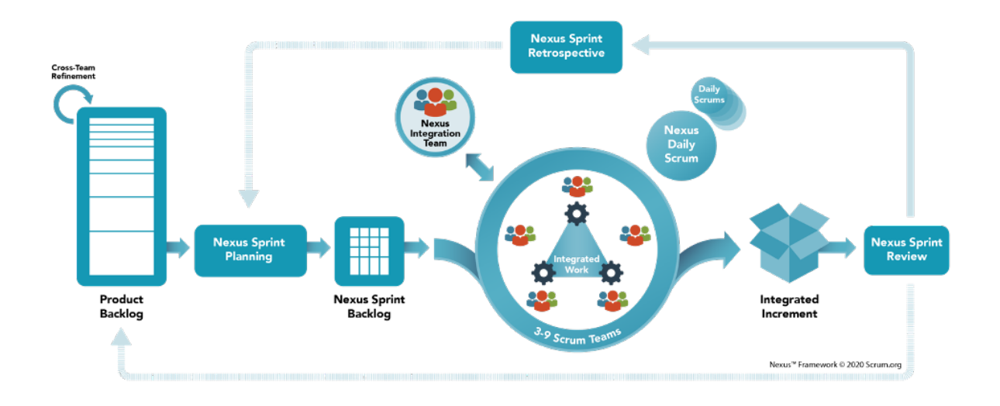

# Nexus™ ガイド

Nexus を使⽤した⼤規模スクラムの公式ガイド

### **Nexus** ガイドの⽬的

プロダクトのデリバリーは複雑であり、開発作業を価値のあるプロダクトに統合するには、多 くの異なる活動を調整する必要がある。 Nexus とは、⼤規模なプロダクトのデリバリーを発展 および維持させるためのフレームワークである。 Nexus はスクラムの上に構築されており、ス クラムの経験主義と価値基準を促進しているが、複数のスクラムチームの依存関係を最⼩限に 抑えて管理するために、必要な部分に限定してスクラムを拡張している。

Nexus フレームワークは、スクラムガイド(www.scrumguides.org)で⽂書化されているスクラム フレームワークの⽬的と意図を継承している。⼤規模スクラムもまたスクラムである。 Nexus では、スクラムの中⼼的なデザインやアイデアを変更したり、要素を省いたり、ルールを否定 したりするようなことはしていない。そのようなことをすれば、問題が隠蔽され、スクラムの 利点が制限されてしまう。場合によっては、スクラムが無意味なものになってしまうだろう。

本ガイドには Nexus の定義が含まれている。 Nexus フレームワークの各要素には特定の⽬的が あり、複数のチームが協⼒するスクラムの利点をスケールさせるために、チームや組織にとっ て不可⽋なものとなっている。

組織で Nexus を利⽤していると、Nexus フレームワークの活⽤に役⽴つ補完的なパターン、プロ セス、プラクティスが⾒つかることだろう。だが、スクラムと同様に、そうした戦術にはさま ざまなものがあるため、本ガイドとは別のところで説明する。

Nexus は Ken Schwaber と Scrum.org が開発した。

© 2021 Scrum.org. Offered for license under the Offered for license under the Attribution Share Alike license of Creative Commons, accessible at http://creativecommons.org/licenses/by-sa/4.0/legalcode and also described in summary form at http://creativecommons.org/licenses/by-sa/4.0/. By utilizing this Nexus Guide, you acknowledge and agree that you have read and agree to be bound by the terms of the Attribution Share-Alike license of Creative Commons.

#### 目次

| Nexus ガイドの目的                               | 2  |
|--------------------------------------------|----|
| Nexus の定義                                  | 4  |
| Nexus の理論                                  | 4  |
| Nexus フレームワーク                              | 4  |
| Nexus における責任者                              | 5  |
| Nexus 統合チーム                                | 5  |
| Nexus イベント                                 | 6  |
| スプリント                                      | 7  |
| クロスチームリファインメント                             | 7  |
| Nexus スプリントプランニング                          | 7  |
| Nexus デイリースクラム                             | 8  |
| Nexus スプリントレビュー                            | 8  |
| Nexus スプリントレトロスペクティブ                       | 8  |
| Nexus の作成物と確約(コミットメント)                     | 9  |
| プロダクトバックログ                                 | 9  |
| 確約(コミットメント):プロダクトゴール                       | 9  |
| Nexus スプリントバックログ                           | 9  |
| 確約(コミットメント):Nexus スプリントゴール                 | 9  |
| 統合インクリメント                                  | 10 |
| 確約(コミットメント):完成の定義                          | 10 |
| 最後に                                        | 10 |
| 謝辞                                         | 10 |
| 翻訳について                                     | 10 |
| 用語集                                        | 11 |
| Novue ガイド 2019 年版から Novue ガイド 2021 年版への変更占 | 11 |

#### **Nexus** の定義

Nexus とは、 1 つのプロダクトを協⼒しながらデリバリーする、およそ 3〜9 のスクラムチーム からなるグループである。それは⼈々やモノのつながりである。 Nexus には 1 ⼈のプロダクト オーナーが存在し、複数のスクラムチームが作業する単⼀のプロダクトバックログを管理する。

Nexus フレームワークは、「責任者」「イベント」「作成物」を定義しており、それらが Nexus に含まれる複数のスクラムチームの作業を結びつけている。 Nexus はスクラムの基礎の上に構 築されており、スクラムを使ったことがある⼈ならその構成要素には馴染みがあるだろう。 Nexus では、複数のスクラムチームが単⼀のプロダクトバックログからゴールを満たす「統合イ ンクリメント」を構築できるように、必要な部分に限定してスクラムを拡張している。

### **Nexus** の理論

Nexus の本質は、スクラムの根底にあるボトムアップの情報収集と経験主義を維持および強化し ながら、 1 つのチームで成し遂げる以上の価値を、複数のスクラムチームで提供できるように することである。単⼀のプロダクトに取り組む複数のスクラムチームが提供する価値を⼤きく することが、Nexus の⽬標となる。それを実現するには、複雑性を軽減する必要がある。複数の チームが協⼒しながら、統合された、価値のある、有⽤なプロダクトインクリメントを少なく ともスプリントごとにデリバリーするときには、こうした複雑性に遭遇するものである。

Nexus フレームワークは、チーム間の依存関係の削減、チームの⾃⼰管理と透明性の維持、最終 的な責任の担保など、よくあるスケーリングの課題を解決するのに役⽴つ。 Nexus は依存関係 を明らかにする。こうした依存関係は、以下のようなミスマッチによって⽣じる。

- 1. プロダクト構造:プロダクトのなかで関⼼事が分離されている度合いが、統合されたプロダ クトリリースを作成するときの複雑性に⼤きな影響を与える。
- 2. コミュニケーション構造:チーム内やチーム間でのコミュニケーションのやり⽅が、作業を 完了させる能⼒に影響を与える。コミュニケーションやフィードバックの遅れは、作業の 流れを悪化させる。

こうした依存関係を軽減または排除するために、 Nexus はプロセス、プロダクト構造、コミュ ニケーション構造を変更する機会を提供している。

直感的ではないだろうが、提供する価値を⼤きくするために必ずしも⼈を増やす必要はない。 ⼈数やプロダクトの規模が増加すると、複雑性や依存関係、コラボレーションの必要性、意思 決定に関わるコミュニケーションパスの数も増えていく。より多くの価値を提供するには、ス ケールダウンして、関わる⼈数を減らすことが重要なプラクティスとなる。

#### **Nexus** フレームワーク

Nexus はスクラムの上に構築されているが、チームを超えた仕事の依存関係やコラボレーション の課題を解決できるように、基礎となる要素を拡張している。 Nexus は、スクラムとほぼ同様 の経験的プロセスである(図 1 参照)。

Nexus は、以下のようにスクラムを拡張している。

- l 責任者:Nexus 統合チームは、Nexus が価値のある有⽤な統合インクリメントを少なく ともスプリントごとに提供できるようにする。Nexus 統合チームは、プロダクトオーナ ー、スクラムマスター、Nexus 統合チームのメンバーで構成される。
- l イベント:Nexus イベントは、通常のスクラムイベントに追加・包含・置換することで、 強化させたものである。こうした変更により、Nexus のすべてのスクラムチームの全体 的な取り組みと、個々のスクラムチームの取り組みの両⽅に役⽴つ。Nexus スプリント ゴールは、スプリントの⽬標である。
- l 作成物:すべてのスクラムチームは、共通した単⼀のプロダクトバックログを使⽤す る。プロダクトバックログアイテムのリファインメントが終わり、準備完了の状態に なれば、スプリントにおいてどのチームが作業を担当する可能性が⾼いかが明らかに なる。Nexus スプリントバックログは、スプリントにおける透明性の確保を⽀援する。 統合インクリメントは、Nexus が完了させた作業の総和を表す。

図 1: Nexus フレームワーク

### **Nexus** における責任者

Nexus は、プロダクトゴールに向けて⼀緒に働く複数のスクラムチームで構成されている。スク ラムフレームワークでは、スクラムチームにおける 3 つの明確な責任者を定義している。それ は「開発者」「プロダクトオーナー」「スクラムマスター」である。これらの責任者は、スク ラムガイドで規定されている。 Nexus には「Nexus 統合チーム」という責任者が追加されている。

#### **Nexus 統合チーム**

Nexus 統合チームには、少なくともスプリントごとに統合インクリメント(Nexus が完了させた 作業をまとめたもの)を完成させる最終的な責任がある。 Nexus 統合チームによって集中がも たらされ、複数のスクラムチームの責任者が集まり、スクラムで規定された価値のある有⽤な インクリメントを作成することが可能になる。

スクラムチームが Nexus における統合の問題に取り組むのに対して、 Nexus 統合チームは統合 のフォーカルポイント(中⼼部)を Nexus に提供する。チーム間の技術的/⾮技術的な制約を 解消することも統合に含まれる。こうした制約により、統合インクリメントを継続的にデリバ リーするという Nexus の能⼒が妨害される可能性もある。 Nexus 統合チームは制約を解消する ために、 Nexus においてボトムアップの情報収集を⾏うべきである。

Nexus 統合チームには、プロダクトオーナー、スクラムマスター、複数のスクラムチームの適切 なメンバーが所属する。適切なメンバーとは、いずれかの時点で Nexus が直⾯する問題の解決 を⽀援できる能⼒と知識を持った⼈たちである。 Nexus 統合チームの構成は、Nexus のニーズに 合わせて変更される可能性がある。 Nexus 統合チームの⼀般的な活動には、コーチング、コン サルティング、依存関係やチーム間の問題を取り上げることなどがある。

#### Nexus 統合チームの構成:

- l プロダクトオーナー:Nexus は単⼀のプロダクトバックログに取り組む。スクラムで規 定されているように、プロダクトバックログには内容について最終的な決定権を持つ 1 ⼈のプロダクトオーナーが割り当てられる。Nexus 統合チームのプロダクトオーナーは、 プロダクトの価値と、Nexus の複数のスクラムチームによって実⾏および統合された作 業の価値を最⼤化することの結果に責任を持つ。Nexus 統合チームのプロダクトオーナ ーは、プロダクトバックログの効果的な管理についても結果に責任を持つ。どのよう にやるかは、組織、Nexus、スクラムチーム、個⼈によって⼤きく異なる。
- l スクラムマスター:Nexus 統合チームのスクラムマスターは、Nexus ガイドに記述され たとおりに Nexus のフレームワークが理解され、実施されることの結果に責任を持つ。 Nexus 統合チームのスクラムマスターは、Nexus のスクラムチームのスクラムマスター になることもある。
- l **1** ⼈以上の **Nexus** 統合チームのメンバー:Nexus 統合チームは、スクラムチームのツー ルやプラクティスの導⼊を⽀援しているメンバーで構成されることが多い。こうした ツールやプラクティスのおかげで、スクラムチームは完成の定義を満たせるような価 値のある有⽤な統合インクリメントをデリバリーする能⼒を⾼めることができる。

Nexus 統合チームには、価値のある有⽤なインクリメントを⽣み出す能⼒を向上させるようなプ ラクティスやツールをスクラムチームが習得・実装・学習できるように、コーチングやガイド をする責任がある。

Nexus 統合チームのメンバーであることは、スクラムチームのメンバーであることよりも優先さ れる。 Nexus 統合チームの責任を果たしていれば、スクラムチームのチームメンバーとしても 作業できる。この優先順位があるため、複数のチームに影響を与える問題を解決する作業が優 先されることになる。

#### **Nexus** イベント

Nexus では、スクラムで定義されたイベントを追加・拡張している。 Nexus イベントの期間は、 スクラムガイドの対応するイベントの⻑さによって決まる。 Nexus イベントのタイムボックス は、対応するイベントに追加されたものである。

規模が⼤きくなると、 Nexus のすべてのメンバーで情報の共有や合意をすることは現実的では なくなるだろう。特に明記されていなければ、 Nexus イベントには期待される成果を実現する のに必要な Nexus のメンバーが参加すればいい。

Nexus イベントの構成:

#### **スプリント**

Nexus のスプリントは、スクラムのスプリントと同じである。 Nexus のスクラムチームは、1 つ の統合インクリメントを開発する。

#### **クロスチームリファインメント**

プロダクトバックログのクロスチームリファインメント(訳注:複数のチームで⼿を⼊れるこ と)により、 Nexus のチーム間の依存関係が軽減または削除される。依存関係が明らかとなり、 チーム間で認識され、それが削減または最⼩化されるように、プロダクトバックログを分解す る必要がある。巨⼤で漠然とした要求から、単⼀のスクラムチームがスプリントでデリバリー できる実⾏可能な作業まで、プロダクトバックログはさまざまなレベルで分解されていく。

⼤規模なプロダクトバックログのクロスチームリファインメントには 2 つの⽬的がある:

- l プロダクトバックログアイテムのデリバリーを担当するチームをすべてのスクラムチ ームで事前に把握できるようにすること。
- l デリバリーを担当するチーム間の依存関係を特定できるようにすること。

クロスチームリファインメントは継続的に実施する。上記の 2 つの⽬的を最適化するために、 その頻度、期間、出席者はさまざまである。

各スクラムチームでも必要に応じてリファインメントを続けることがある。これは、プロダク トバックログアイテムを Nexus スプリントプランニングで選択できるようにするためである。 プロダクトバックログを適切にリファインメントしておけば、 Nexus スプリントプランニング で新たな依存関係が⾒つかる可能性を最⼩限にできる。

#### **Nexus スプリントプランニング**

Nexus スプリントプランニングの⽬的は、 1 つのスプリントにおける Nexus のすべてのスクラム チームの活動を調整することである。プロダクトオーナーと各スクラムチームの適切な代表者 がスプリントを計画するために集まる。

Nexus スプリントプランニングの結果は以下である:

- l **Nexus** スプリントゴールは、プロダクトゴールに沿ったものであり、スプリント期間中 に Nexus が達成すべき⽬的が記述されたものである。
- l スプリントゴールは、各スクラムチームが保持しており、それぞれが Nexus スプリン トゴールに沿ったものである。
- l **Nexus** スプリントバックログは、Nexus スプリントゴールに向けた Nexus の作業を表し ており、チーム間の依存関係を明らかにするものである。

l スプリントバックログは、各スクラムチームが保持しており、Nexus スプリントゴール を達成するための作業を明らかにするものである。

#### **Nexus デイリースクラム**

Nexus デイリースクラムの⽬的は、統合の問題を特定し、 Nexus スプリントゴールの進捗を検査 することである。 Nexus デイリースクラムには、各スクラムチームの適切な代表者が参加する。 そして、統合インクリメントの現在の状態を検査し、統合に関わる問題を特定し、新たに発⾒ されたチーム間の依存関係や影響を特定する。各スクラムチームのデイリースクラムは、 Nexus デイリースクラムを補完するものである。主に Nexus デイリースクラムで提起された統合の問 題の対応について、その⽇の計画を⽴てる。

Nexus デイリースクラムは、 Nexus のスクラムチームが計画を調整するためだけにあるのではな い。⼀⽇中、チーム間でコミュニケーションしながら、スプリントの残作業の適応や再計画に ついて綿密な議論をすることもある。

#### **Nexus スプリントレビュー**

Nexus スプリントレビューは、スプリントの最後に開催される。今回のスプリントで Nexus が完 成させた統合インクリメントに対してフィードバックを提供し、今後の適応を決定するもので ある。

ステークホルダーから統合インクリメント全体に対するフィードバックを得ることになるため、 Nexus スプリントレビューは各スクラムチームのスプリントレビューを置き換える。 Nexus スプ リントレビューでは、 Nexus が主要なステークホルダーに作業の結果を⽰し、プロダクトゴー ルの進捗を説明する。ただし、すべての作業を詳細に⾒せることはできないだろう。 Nexus ス プリントレビューの参加者はこうした情報にもとづいて、 Nexus がフィードバックに対応する ためにこれから何をすべきかについて⼀緒に話し合う。また、話し合いの結果を反映して、プ ロダクトバックログを調整することもある。

#### **Nexus スプリントレトロスペクティブ**

Nexus スプリントレトロスペクティブの⽬的は、 Nexus 全体の品質と有効性を向上させる⽅法を 計画することである。個⼈、チーム、相互作⽤、プロセス、ツール、完成の定義について、今 回のスプリントでどのように⾏なわれたのかを Nexus が検査する。各スクラムチームのスプリ ントレトロスペクティブは、チームを改善するだけでなく、 Nexus スプリントレトロスペクテ ィブを補完するものである。そのために、 Nexus 全体に影響する問題に対してボトムアップの 情報収集を⽤いる。

Nexus スプリントレトロスペクティブでスプリントは終了する。

### **Nexus** の作成物と確約(コミットメント)

作成物は、作業や価値を表している。スクラムガイドに記述されているように、透明性を最⼤ 化するものである。 Nexus 統合チームは、Nexus のスクラムチームと連携し、すべての作成物の 透明性が確保され、統合インクリメントの状態が広く理解されるようにする。

Nexus は以下の作成物でスクラムを拡張している。各作成物には確約(コミットメント)が含ま れる。これらの確約は、Nexus とステークホルダーのために、経験主義とスクラムの価値基準を 強化するために存在する。

#### **プロダクトバックログ**

Nexus とすべてのスクラムチームに対して、プロダクトの改善に必要なリストを含むプロダクト バックログはただ 1 つだけ存在する。⼤規模の場合、依存関係を検出して最⼩化できるレベル まで、プロダクトバックログを理解しなければならない。プロダクトオーナーはプロダクトバ ックログの結果に責任を持つ。そこには、プロダクトバックログの内容・可⽤性・順序も含ま れる。

#### 確約(コミットメント):プロダクトゴール

プロダクトゴールへの確約は、プロダクトゴールである。プロダクトゴールは、将来のプロダ クトの状態を記述し、Nexus の⻑期的なゴールを提供する。

### **Nexus スプリントバックログ**

Nexus スプリントバックログは、Nexus スプリントゴールと各スクラムチームのスプリントバッ クログにあるプロダクトバックログアイテムをまとめたものである。スプリントにおける依存 関係や作業の流れを強調するために使⽤する。スプリントでは、学習に合わせて Nexus スプリ ントバックログを更新する。 Nexus スプリントバックログは、 Nexus デイリースクラムで進捗 を検査できる程度に詳細にすべきである。

#### 確約(コミットメント):**Nexus** スプリントゴール

Nexus スプリントバックログへの確約は、**Nexus** スプリントゴールである。 Nexus スプリントゴ ールは、Nexus で 1 つだけ存在する。そこには、Nexus に含まれるスクラムチームのすべての作 業とスプリントゴールがまとめられている。スクラムチームが個別に活動するのではなく、協 ⼒して作業するように促すことで、 Nexus はスプリントにおいて⼀貫性と集中を実現できる。 Nexus スプリントゴールは、 Nexus スプリントプランニングで作成され、 Nexus スプリントバッ クログに追加される。スクラムチームがスプリントで作業をするときは、Nexus スプリントゴー ルを念頭に置く。 Nexus スプリントレビューでは、 Nexus スプリントゴールを満たした価値の ある有⽤な機能を提⽰する必要がある。それは、ステークホルダーからフィードバックを受け 取るためである。

#### **統合インクリメント**

統合インクリメントとは、プロダクトゴールに向けて Nexus が作業したものを統合した現在の 総和である。統合インクリメントは Nexus スプリントレビューで検査されるが、スプリントの 終了前にステークホルダーにデリバリーされることもある。統合インクリメントは、完成の定 義を満たさなければならない。

#### 確約(コミットメント):完成の定義

統合インクリメントへの確約は、完成の定義である。完成の定義は、統合された作業がプロダ クトに求められる品質や要求を満たしたときの状態を定義している。統合インクリメントは、 統合され、価値があり、有⽤でなければ完成ではない。 Nexus 統合チームは、各スプリントで 開発された統合インクリメントに適⽤する完成の定義に最終的な責任を持つ。 Nexus のすべて のスクラムチームは、完成の定義を決めて、それを守る必要がある。個々のスクラムチームは、 ⾃⼰管理してこの状態を達成する。チームのなかで独⾃の完成の定義を適⽤しても構わないが、 統合インクリメントの完成の定義よりも緩い基準を適⽤してはならない。

作成物の状態にもとづいた決定の有効性は、作成物の透明性によって決まる。つまり、不完全 または部分的な情報は、不正確または⽋陥のある決定につながる。このような決定は、Nexus の 規模にまで拡⼤する可能性がある。

#### 最後に

Nexus は無料であり、本ガイドで提供されるものである。スクラムフレームワークと同様に、 Nexus の責任者・作成物・イベント・ルールは不変である。Nexus の⼀部だけを導⼊することも 可能だが、それは Nexus ではない。

#### 謝辞

Nexus および Scaled Professional Scrum は、Ken Schwaber、David Dame、Richard Hundhausen、 Patricia Kong、Rob Maher、Steve Porter、Christina Schwaber、Gunther Verheyen が共同で開発した ものである。これまで Nexus および Scaled Professional Scrum に多⼤な貢献をしくれた Kurt Bittner、Ravi Verma、Fredrik Wendt、Jesse Houwing、Simon Flossmann に感謝する。

#### 翻訳について

本ガイドは、上記の開発者による英語バージョンを⽇本語に翻訳したものである。⽇本語訳は、 ⾓征典(@kdmsnr)と守⽥憲司(@wsfjp)が担当した。

翻訳に関する連絡先:⾓征典(kdmsnr@gmail.com)

#### ⽤語集

| General Terms                | ⼀般⽤語                 |
|------------------------------|----------------------|
| Nexus                        | Nexus                |
| Events                       | イベント                 |
| Nexus Sprint Planning        | Nexus スプリントプランニング    |
| Nexus Daily Scrum            | Nexus デイリースクラム       |
| Nexus Sprint Review          | Nexus スプリントレビュー      |
| Nexus Sprint Retrospective   | Nexus スプリントレトロスペクティブ |
| Roles                        | 役割                   |
| Nexus Integration Team (NIT) | Nexus 統合チーム          |
| Artifacts                    | 作成物                  |
| Integrated Increment         | 統合インクリメント            |

## **Nexus** ガイド **2018** 年版から **Nexus** ガイド **2021** 年版 への変更点

- 1. Nexus ガイド 2021 年版には、スクラムガイドの最新バージョンの更新を反映している。
- 1. スクラムガイド 2020 年版では、プロダクトゴールと確約(コミットメント)が導⼊さ れている。スクラムガイドでは、誰が、どのように、何を⾏うかを決定する、クロスファンク ショナルで⾃⼰管理型のスクラムチームのことが記述されている。Nexus ガイド 2021 年版には、 こうした変更を反映している。
- 2. Nexus フレームワークの⽬標は何か?
- 1. Nexus の理論のセクションでは、Nexus の⽬標は「単⼀のプロダクトに取り組む複数の スクラムチームが提供する価値を⼤きくすること」だと述べている。それを実現するために、 透明性を⾼めることに集中して、チームが協同作業するときに遭遇する複雑性を軽減させる。 つまり、Nexus ガイドでも触れているが、より多くの価値を提供するには、スケールダウンが重 要なプラクティスになることを意味している。
- 2. チーム間の依存関係、チームの⾃⼰管理、透明性、説明責任は、よくあるスケーリング の課題である。これらの依存関係は、ソフトウェアの領域においては、要件、ドメイン知識、 ソフトウェアやテストの成果物などと関連する。だが、ソフトウェア開発の領域以外にも Nexus ガイドを⼀般的に適⽤できるように、これらのカテゴリーを削除した。
- © 2021 Scrum.org. Offered for license under the Offered for license under the Attribution Share Alike license of Creative Commons, accessible at http://creativecommons.org/licenses/by-sa/4.0/legalcode and also described in summary form at http://creativecommons.org/licenses/by-sa/4.0/. By utilizing this Nexus Guide, you acknowledge and agree that you have read and agree to be bound by the terms of the Attribution Share-Alike license of Creative Commons.

- 3. プロダクト開発におけるチーム間の依存関係は、多くの場合、プロダクト構造とコミュ ニケーション構造の不⼀致によって引き起こされる。このことについての説明を追加した。
- 3. ⽬的駆動の Nexus イベント
- 1. スプリントは Nexus のスクラムチームが単⼀の統合インクリメントを作成するイベント であると明⽰的に記述した。これはスクラムと同じである。
- 2. リファインメントを「クロスチームリファインメント」に変更した。プロダクトバック ログのクロスチームリファインメントは、Nexus のチーム間の依存関係を軽減または削減する。
- 3. Nexus スプリントプランニングと Nexus スプリントレトロスペクティブのイベントから 実施⼿順を排除して、指⽰的な部分を軽減させた。代わりにイベントの⽬的を記載した。
- 1. Nexus フレームワークの図の Nexus スプリントプランニングを変更した。それに合 わせて Nexus スプリントレトロスペクティブも変更した。(訳注:統合インクリメントとレビ ューの順番は変わっているが、その他は変わっていないように⾒える。)
- 4. 明快さと簡潔さの改善
- 1. Nexus ガイド 2021 年版では、スクラムガイド 2020 年版と同様に、指⽰的な⽂⾔を 削除して、幅広い読者のために⽂章を簡略にした。

© 2021 Scrum.org. Offered for license under the Offered for license under the Attribution Share Alike license of Creative Commons, accessible at http://creativecommons.org/licenses/by-sa/4.0/legalcode and also described in summary form at http://creativecommons.org/licenses/by-sa/4.0/. By utilizing this Nexus Guide, you acknowledge and agree that you have read and agree to be bound by the terms of the Attribution Share-Alike license of Creative Commons.